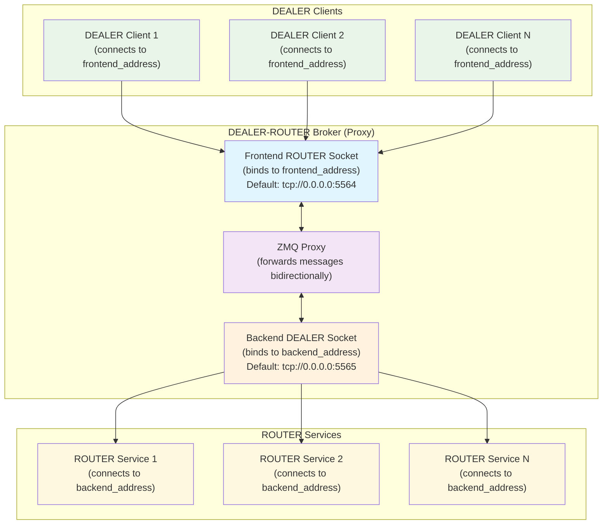

<!--
#  SPDX-FileCopyrightText: Copyright (c) 2025 NVIDIA CORPORATION & AFFILIATES. All rights reserved.
#  SPDX-License-Identifier: Apache-2.0
-->


## Architecture Overview

The DEALER-ROUTER broker acts as a proxy that forwards messages between multiple DEALER clients and multiple ROUTER services.

### Connection Details

**Frontend (ROUTER socket):**
- Binds to `frontend_address` (config: `router_address`)
- Default: `tcp://0.0.0.0:5564`
- Receives connections from DEALER clients
- Handles load balancing and routing to backend

**Backend (DEALER socket):**
- Binds to `backend_address` (config: `dealer_address`)
- Default: `tcp://0.0.0.0:5565`
- Connects to ROUTER services
- Forwards messages from frontend to services

### Message Flow

1. **Request Flow:**
   ```
   DEALER Client → frontend_address → Frontend ROUTER → Proxy → Backend DEALER → backend_address → ROUTER Service
   ```

2. **Response Flow:**
   ```
   ROUTER Service → backend_address → Backend DEALER → Proxy → Frontend ROUTER → frontend_address → DEALER Client
   ```

### Configuration

The broker uses `ZMQTCPDealerRouterBrokerConfig`:
- `router_port: 5564` - Frontend port for DEALER clients
- `dealer_port: 5565` - Backend port for ROUTER services
- `host: "0.0.0.0"` - Bind address

### Key Benefits

- **Load Balancing:** Multiple DEALER clients can connect to the same services
- **Service Discovery:** Clients don't need to know specific service addresses
- **Fault Tolerance:** Services can be added/removed without affecting clients
- **Scalability:** Easy to add more clients or services without reconfiguration
