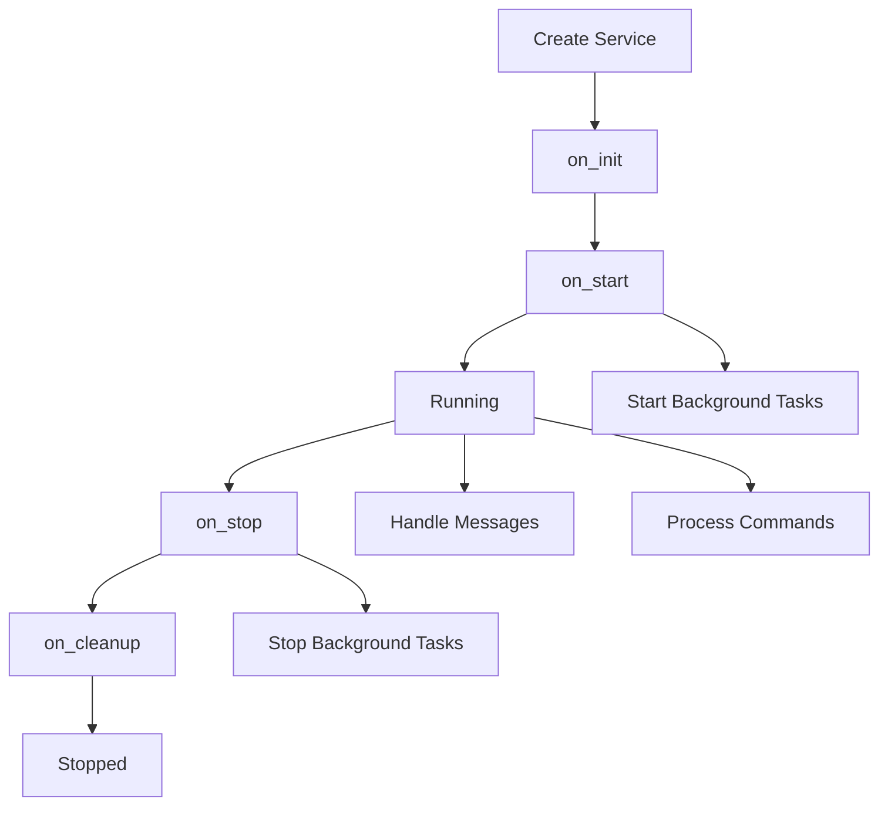

<!--
#  SPDX-FileCopyrightText: Copyright (c) 2025 NVIDIA CORPORATION & AFFILIATES. All rights reserved.
#  SPDX-License-Identifier: Apache-2.0
-->
# AIPerf Lifecycle - Dramatically Simplified Service Management

Welcome to the **dramatically simplified AIPerf Lifecycle system** - a ground-up rewrite that makes service development **intuitive and clean**.

## 🎯 The New Simplified Approach

The new system has a clear separation of concerns:

### 📦 **Simple Inheritance for Lifecycle**
```python
class MyService(AIPerf):
    async def on_init(self):
        await super().on_init()  # Always call super()
        # Your initialization logic here

    async def on_start(self):
        await super().on_start()  # Always call super()
        # Your start logic here
```

### 🎯 **Decorators Only for Dynamic Behavior**
```python
    @message_handler("DATA_MESSAGE")
    async def handle_data(self, message):
        # Dynamic message handling

    @command_handler("GET_STATUS")
    async def get_status(self, command):
        # Dynamic command handling

    @background_task(interval=5.0)
    async def periodic_work(self):
        # Dynamic background tasks
```

## ✨ Key Benefits

### 🔧 **Dramatically Simpler Inheritance**
```python
# OLD WAY - Complex multiple inheritance
class OldService(BaseService, AIPerfMessagePubSubMixin, CommandMessageHandlerMixin, ProcessHealthMixin):
    @supports_hooks(AIPerfHook.ON_INIT, AIPerfHook.ON_START)
    def __init__(self, service_config, user_config, sub_client, pub_client, **kwargs):
        super().__init__(service_config=service_config, **kwargs)

# NEW WAY - Simple single inheritance
class NewService(AIPerf):
    def __init__(self):
        super().__init__(service_id="my_service")

    async def on_init(self):
        await super().on_init()  # Just call super()!
        # Your logic here
```

### 🚀 **No Configuration or Auto-Discovery Complexity**
```python
# OLD WAY - Complex auto-discovery and method binding
@supports_hooks(AIPerfHook.ON_INIT, AIPerfHook.ON_MESSAGE)
class OldService(HooksMixin):
    def __init__(self, **kwargs):
        super().__init__(**kwargs)  # Complex initialization

    @on_init  # Auto-discovered through complex introspection
    async def _initialize(self):
        pass

# NEW WAY - Simple inheritance, decorators only where needed
class NewService(AIPerf):
    async def on_init(self):  # Simple inheritance, no decorators needed
        await super().on_init()
        # Your logic

    @message_handler("DATA")  # Decorators only for dynamic behavior
    async def handle_data(self, message):
        pass
```

### 🎛️ **Crystal Clear Patterns**
```python
class MyService(AIPerf):
    # =================================================================
    # Simple Lifecycle - Just override and call super()
    # =================================================================

    async def on_init(self):
        await super().on_init()
        self.db = await connect_database()

    async def on_start(self):
        await super().on_start()  # This starts background tasks automatically
        self.logger.info("Service ready!")

    async def on_stop(self):
        await super().on_stop()  # This stops background tasks automatically
        await self.db.close()

    # =================================================================
    # Dynamic Handlers - Use decorators
    # =================================================================

    @message_handler("USER_DATA")
    async def handle_user_data(self, message):
        await self.process_user_data(message.content)

    @command_handler("GET_STATUS")
    async def get_status(self, command):
        return {"status": "healthy", "uptime": self.get_uptime()}

    @background_task(interval=10.0)
    async def health_check(self):
        await self.send_heartbeat()
```

## 🏗️ Architecture Overview

### Core Components

1. **`LifecycleService`** - Simple base class with inheritance-based lifecycle
2. **`AIPerf` (ManagedLifecycleService)** - Full-featured service with messaging built-in
3. **`MessageBus`** - Clean messaging system
4. **`TaskManager`** - Background task management
5. **Simple Decorators** - Only for dynamic handlers

### Inheritance Chain

```
object
  └── LifecycleService       # Simple lifecycle management
      └── ManagedLifecycleService (AIPerf)  # + messaging & tasks
          └── YourService    # Your business logic
```

### Lifecycle Flow



## 🚀 Quick Start Guide

### 1. Basic Service with Simple Inheritance

```python
from aiperf.lifecycle import AIPerf

class MyService(AIPerf):
    def __init__(self):
        super().__init__(service_id="my_service")
        self.data = []

    async def on_init(self):
        await super().on_init()  # Always call super()
        self.logger.info("Setting up resources...")
        self.db = await connect_database()

    async def on_start(self):
        await super().on_start()  # Always call super()
        self.logger.info("Service is ready!")

    async def on_stop(self):
        await super().on_stop()  # Always call super()
        await self.db.close()

    async def on_cleanup(self):
        await super().on_cleanup()  # Always call super()
        self.logger.info("Cleaned up!")

# Usage
service = MyService()
await service.run_until_stopped()
```

### 2. Adding Message Handling

```python
class DataService(AIPerf):
    def __init__(self):
        super().__init__(service_id="data_service")
        self.processed_count = 0

    async def on_init(self):
        await super().on_init()
        # Simple initialization

    @message_handler("PROCESS_DATA")
    async def handle_data(self, message):
        # Process the data
        result = await self.process(message.content)
        self.processed_count += 1

        # Send result easily
        await self.publish_message("DATA_PROCESSED", {
            "result": result,
            "count": self.processed_count
        })
```

### 3. Adding Command Handling

```python
class StatusService(AIPerf):
    async def on_init(self):
        await super().on_init()
        self.start_time = time.time()

    @command_handler("GET_STATUS")
    async def get_status(self, command):
        return {
            "status": "running",
            "uptime": time.time() - self.start_time,
            "state": self.state.value
        }

    @command_handler("RESTART")
    async def restart(self, command):
        await self.stop()
        await self.start()
        return {"result": "restarted"}

# Send commands to services
response = await service.send_command("GET_STATUS", "status_service")
```

### 4. Adding Background Tasks

```python
class MonitoringService(AIPerf):
    async def on_init(self):
        await super().on_init()
        self.metrics = {}

    async def on_start(self):
        await super().on_start()  # This automatically starts background tasks!
        # No need to manually start tasks

    @background_task(interval=10.0)
    async def collect_metrics(self):
        # Runs every 10 seconds automatically
        self.metrics = await self.gather_system_metrics()
        await self.publish_message("METRICS_UPDATE", self.metrics)

    @background_task(run_once=True)
    async def startup_check(self):
        # Runs once at startup
        await self.verify_system_health()
```

### 5. Inheritance Chain Example

```python
class BaseBusinessService(AIPerf):
    """Base service with common business logic."""

    async def on_init(self):
        await super().on_init()  # Call LifecycleService.on_init()
        await self.setup_common_business_logic()

    async def setup_common_business_logic(self):
        # Common setup that all business services need
        pass

class SpecificBusinessService(BaseBusinessService):
    """Specific business service."""

    async def on_init(self):
        await super().on_init()  # Call BaseBusinessService.on_init()
        await self.setup_specific_logic()

    async def setup_specific_logic(self):
        # Specific setup for this service
        pass

    @message_handler("BUSINESS_DATA")
    async def handle_business_data(self, message):
        await self.process_business_data(message.content)
```

## 📚 Complete Examples

See [`examples.py`](./examples.py) for comprehensive examples including:

- **Simple Service**: Basic lifecycle management with inheritance
- **Message Handling**: Clean pub/sub patterns
- **Command/Response**: Request/response patterns
- **Background Tasks**: Automatic task management
- **Inheritance Chains**: Multi-level inheritance examples

## 🔄 Migration from Complex System

### Before (Complex System)
```python
@supports_hooks(
    AIPerfHook.ON_INIT,
    AIPerfHook.ON_START,
    AIPerfHook.ON_MESSAGE,
    AIPerfTaskHook.AIPERF_AUTO_TASK
)
class OldService(
    BaseService,
    AIPerfMessagePubSubMixin,
    CommandMessageHandlerMixin,
    ProcessHealthMixin
):
    def __init__(self, service_config, user_config, **kwargs):
        super().__init__(
            service_config=service_config,
            user_config=user_config,
            **kwargs
        )

    @on_init
    async def _initialize(self):
        # Complex setup
        pass

    @on_message(MessageType.DATA)
    async def _handle_data(self, message):
        # Complex message handling
        pass

    @aiperf_auto_task(interval_sec=30.0)
    async def _health_check(self):
        while not self.stop_requested.is_set():
            # Manual loop management
            pass
```

### After (Simplified System)
```python
class NewService(AIPerf):
    def __init__(self):
        super().__init__(service_id="my_service")

    async def on_init(self):
        await super().on_init()  # Simple inheritance
        # Your setup logic

    @message_handler("DATA")
    async def handle_data(self, message):
        # Simple message handling
        await self.publish_message("RESULT", processed_data)

    @background_task(interval=30.0)
    async def health_check(self):
        # Simple background task - no manual loops!
        await self.check_health()
```

## 🎨 Design Principles

### 1. **Inheritance for Structure**
- Use simple Python inheritance for lifecycle methods
- Always call `super()` to maintain the chain
- Clear, predictable execution order

### 2. **Decorators for Dynamics**
- Use decorators only for dynamic behavior
- Message handlers, command handlers, background tasks
- Auto-discovery only where it adds value

### 3. **Separation of Concerns**
- Lifecycle management: inheritance
- Dynamic behavior: decorators
- No mixing of concerns

### 4. **Pythonic Patterns**
- Follow standard Python conventions
- Use familiar inheritance patterns
- Clear, readable code

## 🧪 Testing

The simplified system is easy to test:

```python
import pytest
from aiperf.lifecycle import AIPerf

class TestService(AIPerf):
    def __init__(self):
        super().__init__(service_id="test_service")
        self.messages_received = []
        self.init_called = False
        self.start_called = False

    async def on_init(self):
        await super().on_init()
        self.init_called = True

    async def on_start(self):
        await super().on_start()
        self.start_called = True

    @message_handler("TEST_MESSAGE")
    async def handle_test(self, message):
        self.messages_received.append(message)

@pytest.mark.asyncio
async def test_simple_lifecycle():
    service = TestService()

    # Test lifecycle
    await service.initialize()
    assert service.init_called

    await service.start()
    assert service.start_called

    # Test messaging
    await service.publish_message("TEST_MESSAGE", "hello")
    await asyncio.sleep(0.1)  # Let message process

    assert len(service.messages_received) == 1
    assert service.messages_received[0].content == "hello"

    await service.stop()
```

## 🎯 Summary

The dramatically simplified AIPerf Lifecycle system provides:

✅ **Simple inheritance** - Standard Python patterns, no complex mixins
✅ **Clear separation** - Lifecycle uses inheritance, handlers use decorators
✅ **Easy to understand** - No auto-discovery complexity for lifecycle
✅ **Powerful where needed** - Decorators for dynamic behavior
✅ **Excellent debugging** - Clear execution flow, predictable inheritance
✅ **Pythonic design** - Familiar patterns, standard conventions

**The result: All the power you need, with dramatically less complexity.**

Ready to build amazing services? Check out the [examples](./examples.py) and [test demo](./test_demo.py)! 🚀
