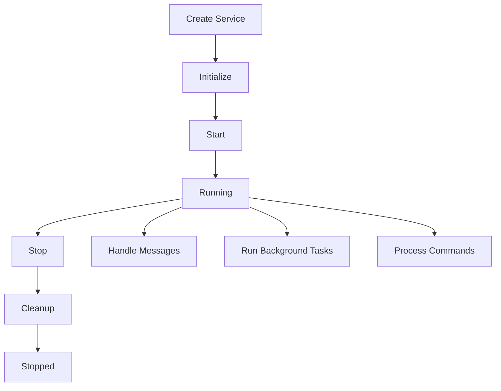

<!--
#  SPDX-FileCopyrightText: Copyright (c) 2025 NVIDIA CORPORATION & AFFILIATES. All rights reserved.
#  SPDX-License-Identifier: Apache-2.0
-->
# AIPerf Lifecycle - Simple, Powerful Service Management

Welcome to the **brand new AIPerf Lifecycle system** - a complete ground-up rewrite designed to make service development simple, intuitive, and powerful.

## 🎯 Why This New System?

The previous AIPerf system, while functional, had significant complexity issues:

- **Complex Mixin Hierarchies**: Required inheriting from multiple mixins (`HooksMixin`, `AIPerfLifecycleMixin`, `AIPerfMessageHandlerMixin`, etc.)
- **Configuration Overhead**: Had to declare supported hooks with `@supports_hooks` decorator
- **Complex Method Binding**: Intricate logic for binding methods to instances
- **Hard to Debug**: Complex inheritance chains made debugging difficult
- **Decorator Proliferation**: Many specialized decorators and configurations

## ✨ Key Benefits of the New System

### 🔧 **Simple Inheritance**
```python
# OLD WAY - Complex multiple inheritance
class OldService(BaseService, AIPerfMessagePubSubMixin, CommandMessageHandlerMixin, ProcessHealthMixin):
    # Need to configure supported hooks
    pass

# NEW WAY - Simple single inheritance
class NewService(AIPerf):
    # Just inherit and implement what you need!
    pass
```

### 🚀 **No Configuration Required**
```python
# OLD WAY - Must declare supported hooks
@supports_hooks(AIPerfHook.ON_INIT, AIPerfHook.ON_START, AIPerfHook.ON_MESSAGE)
class OldService(HooksMixin):
    pass

# NEW WAY - Automatic discovery, no configuration
class NewService(AIPerf):
    # Decorators are automatically discovered!
    @message_handler("DATA_MESSAGE")
    async def handle_data(self, message):
        pass
```

### 🎛️ **Clean Message Handling**
```python
# OLD WAY - Complex setup
@supports_hooks(AIPerfHook.ON_MESSAGE)
class OldService(AIPerfMessageHandlerMixin):
    def __init__(self, sub_client, **kwargs):
        super().__init__(sub_client=sub_client, **kwargs)

    @on_message(MessageType.USER_DATA)
    async def handle_user_data(self, message):
        pass

# NEW WAY - Simple and clean
class NewService(AIPerf):
    @message_handler("USER_DATA")
    async def handle_user_data(self, message):
        # Send response easily
        await self.publish_message("DATA_PROCESSED", result)
```

### ⚡ **Effortless Background Tasks**
```python
# OLD WAY - Complex task management
@supports_hooks(AIPerfTaskHook.AIPERF_AUTO_TASK)
class OldService(AIPerfLifecycleMixin):
    @aiperf_auto_task(interval_sec=5.0)
    async def periodic_task(self):
        while not self.stop_requested.is_set():
            # Manual loop management
            pass

# NEW WAY - Automatic task management
class NewService(AIPerf):
    @background_task(interval=5.0)
    async def periodic_task(self):
        # Just write your logic - no loop management needed!
        await self.do_work()
```

## 🏗️ Architecture Overview

### Core Components

1. **`LifecycleService`** - Base class with simple lifecycle management
2. **`AIPerf` (ManagedLifecycleService)** - Full-featured service with messaging and tasks
3. **`MessageBus`** - Simple, clean messaging system
4. **`TaskManager`** - Straightforward background task management
5. **Decorators** - `@message_handler`, `@command_handler`, `@background_task`

### Lifecycle Flow



## 🚀 Quick Start Guide

### 1. Basic Service

```python
from aiperf.lifecycle import AIPerf

class MyService(AIPerf):
    def __init__(self):
        super().__init__(service_id="my_service")
        self.data = []

    async def on_init(self):
        self.logger.info("Service initializing...")
        # Setup databases, connections, etc.

    async def on_start(self):
        self.logger.info("Service started!")

    async def on_stop(self):
        self.logger.info("Service stopping...")

    async def on_cleanup(self):
        self.logger.info("Cleaning up resources...")

# Usage
service = MyService()
await service.run_until_stopped()  # Handles full lifecycle
```

### 2. Message Handling

```python
class DataProcessor(AIPerf):
    def __init__(self):
        super().__init__(service_id="processor")
        self.processed_count = 0

    @message_handler("PROCESS_DATA")
    async def handle_data(self, message):
        # Process the data
        result = await self.process(message.content)
        self.processed_count += 1

        # Send result
        await self.publish_message("DATA_PROCESSED", {
            "result": result,
            "count": self.processed_count
        })

    @message_handler("STATUS_REQUEST", "HEALTH_CHECK")
    async def handle_status(self, message):
        await self.publish_message("STATUS_RESPONSE", {
            "status": "healthy",
            "processed": self.processed_count
        })
```

### 3. Command Handling

```python
class ControlService(AIPerf):
    def __init__(self):
        super().__init__(service_id="controller")
        self.settings = {"enabled": True}

    @command_handler("GET_SETTINGS")
    async def get_settings(self, command):
        return self.settings.copy()

    @command_handler("UPDATE_SETTINGS")
    async def update_settings(self, command):
        self.settings.update(command.content)
        return {"success": True, "new_settings": self.settings}

# Usage - send commands to services
response = await service.send_command(
    "GET_SETTINGS",
    target_id="controller"
)
```

### 4. Background Tasks

```python
class MonitoringService(AIPerf):
    def __init__(self):
        super().__init__(service_id="monitor")
        self.metrics = {}

    @background_task(interval=10.0)
    async def collect_metrics(self):
        # Runs every 10 seconds
        self.metrics = await self.gather_system_metrics()
        await self.publish_message("METRICS_UPDATE", self.metrics)

    @background_task(interval=60.0)
    async def cleanup_old_data(self):
        # Runs every minute
        await self.cleanup_old_metrics()

    @background_task(run_once=True)
    async def startup_check(self):
        # Runs once at startup
        await self.verify_system_health()
```

## 📚 Complete Examples

See [`examples.py`](./examples.py) for comprehensive examples including:

- **Simple Service**: Basic lifecycle management
- **Message Handling**: Pub/sub messaging patterns
- **Command/Response**: Request/response patterns
- **Background Tasks**: Various task patterns
- **Complete Service**: Real-world example combining all features

## 🔄 Migration from Old System

### Before (Old System)
```python
@supports_hooks(
    AIPerfHook.ON_INIT,
    AIPerfHook.ON_START,
    AIPerfHook.ON_MESSAGE,
    AIPerfTaskHook.AIPERF_AUTO_TASK
)
class OldRecordsManager(
    BaseService,
    AIPerfMessagePubSubMixin,
    CommandMessageHandlerMixin,
    ProcessHealthMixin
):
    def __init__(self, service_config, user_config, **kwargs):
        super().__init__(
            service_config=service_config,
            user_config=user_config,
            **kwargs
        )

    @on_init
    async def _initialize(self):
        # Complex initialization
        pass

    @on_message(MessageType.PARSED_INFERENCE_RESULTS)
    async def _on_parsed_results(self, message):
        # Handle message
        pass

    @aiperf_auto_task(interval_sec=30.0)
    async def _health_check(self):
        while not self.stop_requested.is_set():
            # Manual loop and error handling
            pass
```

### After (New System)
```python
class NewRecordsManager(AIPerf):
    def __init__(self, service_config=None, user_config=None):
        super().__init__(service_id="records_manager")
        self.service_config = service_config
        self.user_config = user_config

    async def on_init(self):
        # Simple initialization
        pass

    @message_handler("PARSED_INFERENCE_RESULTS")
    async def handle_results(self, message):
        # Handle message - no complex setup needed
        pass

    @background_task(interval=30.0)
    async def health_check(self):
        # Just write the logic - no manual loops!
        await self.check_health()
```

## 🎨 Design Principles

### 1. **Simplicity First**
- Single inheritance instead of complex mixins
- Automatic discovery instead of manual configuration
- Clear, readable code patterns

### 2. **Pythonic Design**
- Follow standard Python conventions
- Use familiar patterns (decorators, inheritance)
- Clear error messages and debugging

### 3. **Powerful but Simple**
- Support all current use cases
- Add new capabilities easily
- Maintain backward compatibility where possible

### 4. **Developer Experience**
- Easy to learn and use
- Great documentation and examples
- Excellent debugging experience

## 🔧 Advanced Features

### Custom Message Bus
```python
from aiperf.lifecycle import MessageBus, set_message_bus

# Create custom message bus with special configuration
custom_bus = MessageBus(logger=my_logger)
set_message_bus(custom_bus)

# All services will now use the custom bus
service = MyService()  # Uses custom_bus automatically
```

### Custom Task Manager
```python
from aiperf.lifecycle import TaskManager, set_task_manager

# Create custom task manager
custom_manager = TaskManager(logger=my_logger)
set_task_manager(custom_manager)

# All services will use the custom manager
service = MyService()  # Uses custom_manager automatically
```

### Manual Task Creation
```python
class MyService(AIPerf):
    async def on_start(self):
        # Create tasks manually if needed
        task = self.create_background_task(
            self.my_custom_coroutine(),
            name="custom_task"
        )

        # Create periodic tasks manually
        periodic_task = self.create_periodic_task(
            self.my_function,
            interval=5.0,
            name="periodic_work"
        )
```

## 🧪 Testing

The new system is designed to be easy to test:

```python
import pytest
from aiperf.lifecycle import AIPerf, MessageBus, TaskManager

class TestService(AIPerf):
    def __init__(self):
        super().__init__(service_id="test_service")
        self.messages_received = []

    @message_handler("TEST_MESSAGE")
    async def handle_test(self, message):
        self.messages_received.append(message)

@pytest.mark.asyncio
async def test_service_messaging():
    # Create isolated test environment
    test_bus = MessageBus()
    test_manager = TaskManager()

    service = TestService()
    service.message_bus = test_bus
    service.task_manager = test_manager

    # Test the service
    await service.initialize()
    await service.start()

    await service.publish_message("TEST_MESSAGE", "hello")
    await asyncio.sleep(0.1)  # Let message process

    assert len(service.messages_received) == 1
    assert service.messages_received[0].content == "hello"

    await service.stop()
```

## 🎯 Summary

The new AIPerf Lifecycle system provides:

✅ **Simple inheritance-based design** - No complex mixins
✅ **Automatic hook discovery** - No manual configuration
✅ **Clean message handling** - Easy pub/sub and command/response
✅ **Effortless background tasks** - Automatic lifecycle management
✅ **Excellent debugging** - Clear, readable execution flow
✅ **Powerful capabilities** - All current features plus more
✅ **Great developer experience** - Easy to learn and use

**The new system is everything the old system was, but simpler, cleaner, and more powerful.**

Ready to get started? Check out the [examples](./examples.py) and start building amazing services! 🚀
