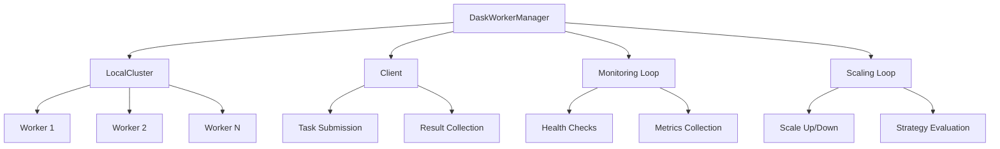

<!--
#  SPDX-FileCopyrightText: Copyright (c) 2025 NVIDIA CORPORATION & AFFILIATES. All rights reserved.
#  SPDX-License-Identifier: Apache-2.0
# 
#  Licensed under the Apache License, Version 2.0 (the "License");
#  you may not use this file except in compliance with the License.
#  You may obtain a copy of the License at
# 
#  http://www.apache.org/licenses/LICENSE-2.0
# 
#  Unless required by applicable law or agreed to in writing, software
#  distributed under the License is distributed on an "AS IS" BASIS,
#  WITHOUT WARRANTIES OR CONDITIONS OF ANY KIND, either express or implied.
#  See the License for the specific language governing permissions and
#  limitations under the License.
-->
# Dask Worker Manager

A comprehensive, scalable worker management system for AIPerf using Dask for distributed computing and dynamic worker scaling.

## Features

### 🚀 Dynamic Scaling
- **Automatic Scaling**: Scale workers based on CPU usage, queue length, or adaptive algorithms
- **Manual Scaling**: Programmatic control over worker count
- **Resource Profiles**: Predefined configurations (micro, small, medium, large, xlarge)
- **Configurable Thresholds**: Fine-tune scaling behavior

### 📊 Monitoring & Metrics
- **Real-time Metrics**: CPU usage, memory consumption, task completion rates
- **Cluster Overview**: Total workers, active workers, pending tasks
- **Worker Health Checks**: Automatic health monitoring with heartbeats
- **Dashboard Integration**: Built-in Dask dashboard for visual monitoring

### 🛡️ Fault Tolerance
- **Automatic Recovery**: Failed workers are automatically replaced
- **Task Retry**: Failed tasks can be automatically retried
- **Graceful Shutdown**: Clean termination of workers and tasks
- **Error Handling**: Comprehensive error handling and logging

### ⚡ Performance
- **Efficient Task Distribution**: Leverages Dask's optimized scheduler
- **Resource Optimization**: Memory and CPU limits per worker
- **Async Processing**: Full async/await support for non-blocking operations
- **Task Prioritization**: Support for task priorities and scheduling

## Architecture



## Configuration

### Basic Configuration

```python
from aiperf.services.worker_manager.dask_worker_manager import (
    DaskWorkerConfig,
    ScalingStrategy,
    WorkerResourceProfile
)

config = DaskWorkerConfig(
    # Worker scaling
    min_workers=2,
    max_workers=20,
    initial_workers=5,

    # Resource configuration
    worker_profile=WorkerResourceProfile.MEDIUM,
    threads_per_worker=4,
    memory_limit="8GB",

    # Scaling strategy
    scaling_strategy=ScalingStrategy.AUTO_ADAPTIVE,
    scale_up_threshold=0.8,
    scale_down_threshold=0.3,
    scaling_interval=30,

    # Monitoring
    heartbeat_interval=10,
    task_timeout=300,
)
```

### Scaling Strategies

#### Manual Scaling
```python
config.scaling_strategy = ScalingStrategy.MANUAL
# Use programmatic scaling methods
await manager.scale_up(3)
await manager.scale_down(2)
```

#### CPU-Based Scaling
```python
config.scaling_strategy = ScalingStrategy.AUTO_CPU
config.scale_up_threshold = 0.8    # Scale up when CPU > 80%
config.scale_down_threshold = 0.3  # Scale down when CPU < 30%
```

#### Queue-Based Scaling
```python
config.scaling_strategy = ScalingStrategy.AUTO_QUEUE
# Scales based on tasks per worker ratio
```

#### Adaptive Scaling
```python
config.scaling_strategy = ScalingStrategy.AUTO_ADAPTIVE
# Combines CPU, memory, and queue metrics
```

### Resource Profiles

| Profile | CPUs | Memory | Use Case |
|---------|------|--------|----------|
| MICRO   | 1    | 1GB    | Light tasks, development |
| SMALL   | 2    | 2GB    | Standard tasks |
| MEDIUM  | 4    | 4GB    | Default, balanced workload |
| LARGE   | 8    | 8GB    | Heavy computation |
| XLARGE  | 16   | 16GB   | Very heavy workloads |

## Usage Examples

### Basic Usage

```python
import asyncio
from aiperf.services.worker_manager.dask_worker_manager import (
    DaskWorkerManager,
    DaskWorkerConfig
)

async def main():
    # Create configuration
    config = DaskWorkerConfig(
        min_workers=2,
        max_workers=10,
        initial_workers=3
    )

    # Initialize manager
    manager = DaskWorkerManager(
        service_config=service_config,
        config=config
    )

    try:
        # Start the cluster
        await manager._initialize()
        await manager._start()

        # Submit tasks
        for i in range(10):
            task_key = await manager.submit_task("compute", f"data_{i}")
            print(f"Submitted task: {task_key}")

        # Monitor status
        status = await manager.get_cluster_status()
        print(f"Active workers: {status['cluster_metrics'].active_workers}")

    finally:
        await manager._stop()
        await manager._cleanup()

asyncio.run(main())
```

### Credit Processing Integration

```python
async def process_credits():
    """Example of processing AIPerf credits."""

    # Manager automatically handles credit drops through
    # the _on_credit_drop callback and processes them
    # using Dask workers

    # Credits are queued and processed asynchronously
    # Results are returned via the credit return mechanism
    pass
```

### Monitoring and Metrics

```python
async def monitor_cluster():
    """Monitor cluster health and performance."""

    while True:
        status = await manager.get_cluster_status()
        metrics = status['cluster_metrics']

        print(f"""
        Cluster Status:
        - Total Workers: {metrics.total_workers}
        - Active Workers: {metrics.active_workers}
        - Pending Tasks: {metrics.pending_tasks}
        - Completed Tasks: {metrics.completed_tasks}
        - Failed Tasks: {metrics.failed_tasks}
        - CPU Utilization: {metrics.cpu_utilization:.1f}%
        - Memory Utilization: {metrics.memory_utilization:.1f}%
        - Queue Length: {metrics.queue_length}
        """)

        await asyncio.sleep(10)
```

## Installation

### Dependencies

Install the required Dask dependencies:

```bash
pip install -r requirements-dask.txt
```

Or manually:

```bash
pip install dask[complete]>=2023.11.0 distributed>=2023.11.0 psutil>=5.9.0
```

### Optional Dependencies

For enhanced features:
- `bokeh>=3.0.0` - For Dask dashboard
- `cloudpickle>=2.0.0` - For serialization
- `tornado>=6.0` - For async networking

## Performance Tuning

### Memory Management

```python
config = DaskWorkerConfig(
    memory_limit="8GB",           # Per-worker memory limit
    threads_per_worker=4,         # Balance threads vs memory
)
```

### Scaling Optimization

```python
config = DaskWorkerConfig(
    scaling_interval=60,          # Less frequent scaling for stability
    scale_up_threshold=0.9,       # More conservative scaling
    scale_down_threshold=0.2,     # Prevent thrashing
)
```

### Task Optimization

```python
# Use task priorities for important work
future = client.submit(
    task_function,
    data,
    priority=10,  # Higher priority
    key="important-task"
)
```

## Monitoring Dashboard

Access the Dask dashboard at: `http://localhost:8787` (default)

The dashboard provides:
- Real-time worker status
- Task execution graphs
- Memory and CPU usage
- Performance metrics
- Task profiling

## Error Handling

The DaskWorkerManager includes comprehensive error handling:

- **Initialization Errors**: Proper cleanup on startup failures
- **Worker Failures**: Automatic worker replacement
- **Task Failures**: Error logging and task retry capabilities
- **Network Issues**: Resilient to temporary network problems
- **Resource Limits**: Graceful handling of memory/CPU constraints

## Best Practices

### Configuration
1. Start with conservative min/max worker counts
2. Use appropriate resource profiles for your workload
3. Set reasonable scaling thresholds (avoid thrashing)
4. Monitor metrics to tune performance

### Scaling
1. Use adaptive scaling for variable workloads
2. Use CPU-based scaling for compute-intensive tasks
3. Use queue-based scaling for high-throughput scenarios
4. Consider manual scaling for predictable workloads

### Monitoring
1. Set up appropriate heartbeat intervals
2. Monitor dashboard for performance insights
3. Track failed task ratios
4. Watch for memory/CPU saturation

### Development
1. Start with smaller worker counts during development
2. Use micro/small profiles for testing
3. Test scaling behavior under load
4. Validate error handling paths

## Troubleshooting

### Common Issues

**Workers not starting:**
- Check memory/CPU limits
- Verify port availability (8786, 8787)
- Check system resource availability

**Scaling not working:**
- Verify scaling strategy configuration
- Check threshold values
- Monitor scaling interval timing

**Tasks failing:**
- Check worker logs
- Verify task serialization
- Monitor resource usage

**Performance issues:**
- Tune worker count and resources
- Check network connectivity
- Monitor task distribution

### Debugging

Enable debug logging:

```python
import logging
logging.getLogger('distributed').setLevel(logging.DEBUG)
logging.getLogger('aiperf.services.worker_manager').setLevel(logging.DEBUG)
```

## Contributing

When contributing to the DaskWorkerManager:

1. Follow Python best practices (PEP 8, type hints)
2. Add comprehensive error handling
3. Include unit tests for new features
4. Update documentation
5. Test scaling behavior under various loads

## Integration with AIPerf

The DaskWorkerManager integrates seamlessly with AIPerf's service architecture:

- **Service Lifecycle**: Standard on_init/on_start/on_stop pattern
- **Credit System**: Automatic credit drop processing
- **Configuration**: Pydantic-based configuration with validation
- **Monitoring**: Standard service monitoring and metrics
- **Communication**: Uses AIPerf's messaging system

This provides a robust, scalable foundation for distributed AI workloads within the AIPerf framework.
