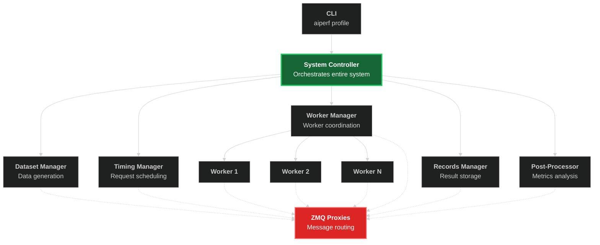
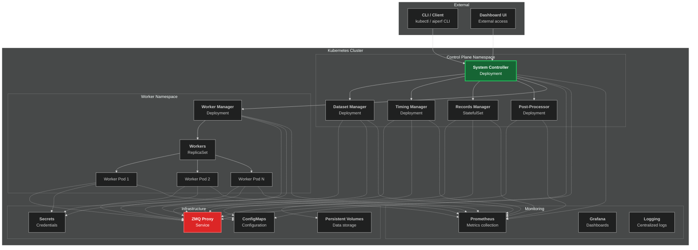
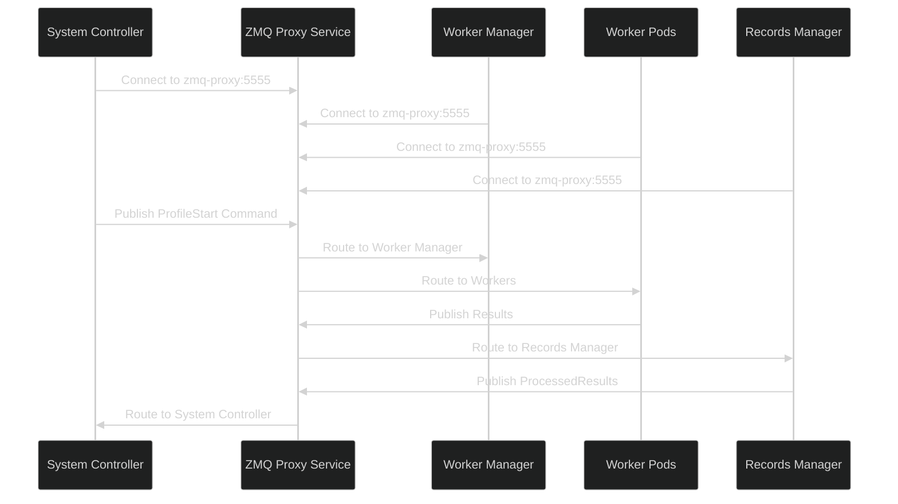

<!--
# SPDX-FileCopyrightText: Copyright (c) 2025 NVIDIA CORPORATION & AFFILIATES. All rights reserved.
# SPDX-License-Identifier: Apache-2.0
-->
# AIPerf Kubernetes Integration Architecture

This document provides a comprehensive architecture design for integrating AIPerf with Kubernetes, enabling scalable, distributed AI model benchmarking across containerized environments.

## Table of Contents

- [Overview](#overview)
- [Current Architecture](#current-architecture)
- [Kubernetes Integration Design](#kubernetes-integration-design)
- [Service Components](#service-components)
- [Networking & Communication](#networking--communication)
- [Configuration Management](#configuration-management)
- [Scaling Strategy](#scaling-strategy)
- [Security Model](#security-model)
- [Monitoring & Observability](#monitoring--observability)
- [Deployment Patterns](#deployment-patterns)
- [Implementation Roadmap](#implementation-roadmap)

## Overview

AIPerf is a comprehensive benchmarking tool for measuring the performance of generative AI models. The current architecture uses a distributed microservices approach with ZeroMQ messaging and multiprocessing for service orchestration. This document outlines the architecture for extending AIPerf to run natively on Kubernetes.

### Goals

- **Scalability**: Leverage Kubernetes for elastic scaling of workers and services
- **Reliability**: Use Kubernetes native features for health checking, recovery, and load balancing
- **Resource Efficiency**: Optimize resource utilization across cluster nodes
- **Multi-tenancy**: Support multiple concurrent benchmark runs
- **Cloud Native**: Embrace Kubernetes-native patterns and tooling

## Current Architecture

AIPerf currently implements a distributed microservices architecture with the following core components:



### Current Communication Patterns

- **ZeroMQ Messaging**: Pub/Sub, Request/Reply, Push/Pull patterns
- **Service Registry**: Centralized service discovery and health tracking
- **Message Types**: Commands, status updates, heartbeats, data transfer
- **Process Management**: Multiprocess service manager with lifecycle control

## Kubernetes Integration Design

### High-Level Architecture

The Kubernetes integration maintains AIPerf's microservices architecture while leveraging Kubernetes-native features for orchestration, scaling, and service discovery.



### Key Design Principles

1. **Service Mesh Ready**: Design compatible with service mesh implementations (Istio, Linkerd)
2. **Resource Isolation**: Use namespaces and resource quotas for multi-tenancy
3. **Declarative Configuration**: All components defined via Kubernetes manifests
4. **Cloud Agnostic**: Compatible with any Kubernetes distribution
5. **Gradual Migration**: Incremental adoption path from multiprocess deployment

## Service Components

### System Controller

**Deployment Type**: Deployment (single replica)
**Role**: Primary orchestrator and entry point

```yaml
apiVersion: apps/v1
kind: Deployment
metadata:
  name: aiperf-system-controller
  namespace: aiperf-system
spec:
  replicas: 1
  selector:
    matchLabels:
      app: aiperf-system-controller
  template:
    metadata:
      labels:
        app: aiperf-system-controller
    spec:
      containers:
      - name: system-controller
        image: aiperf:latest
        command: ["aiperf", "system-controller"]
        env:
        - name: AIPERF_SERVICE_RUN_TYPE
          value: "kubernetes"
        - name: AIPERF_ZMQ_TCP_HOST
          value: "aiperf-zmq-proxy"
        resources:
          requests:
            memory: "256Mi"
            cpu: "200m"
          limits:
            memory: "512Mi"
            cpu: "500m"
```

### Dataset Manager

**Deployment Type**: Deployment (single replica)
**Role**: Data generation and management

```yaml
apiVersion: apps/v1
kind: Deployment
metadata:
  name: aiperf-dataset-manager
  namespace: aiperf-system
spec:
  replicas: 1
  selector:
    matchLabels:
      app: aiperf-dataset-manager
  template:
    spec:
      containers:
      - name: dataset-manager
        image: aiperf:latest
        command: ["aiperf", "service", "--service-type", "dataset_manager"]
        volumeMounts:
        - name: dataset-cache
          mountPath: /app/data
        resources:
          requests:
            memory: "512Mi"
            cpu: "300m"
          limits:
            memory: "2Gi"
            cpu: "1"
      volumes:
      - name: dataset-cache
        persistentVolumeClaim:
          claimName: aiperf-dataset-pvc
```

### Worker Manager

**Deployment Type**: Deployment (configurable replicas)
**Role**: Worker lifecycle and load balancing

```yaml
apiVersion: apps/v1
kind: Deployment
metadata:
  name: aiperf-worker-manager
  namespace: aiperf-workers
spec:
  replicas: 2
  selector:
    matchLabels:
      app: aiperf-worker-manager
  template:
    spec:
      containers:
      - name: worker-manager
        image: aiperf:latest
        command: ["aiperf", "service", "--service-type", "worker_manager"]
        env:
        - name: KUBERNETES_NAMESPACE
          valueFrom:
            fieldRef:
              fieldPath: metadata.namespace
        resources:
          requests:
            memory: "256Mi"
            cpu: "200m"
          limits:
            memory: "512Mi"
            cpu: "500m"
```

### Workers

**Deployment Type**: ReplicaSet/HPA (dynamic scaling)
**Role**: Execute inference requests

```yaml
apiVersion: apps/v1
kind: ReplicaSet
metadata:
  name: aiperf-workers
  namespace: aiperf-workers
spec:
  replicas: 10
  selector:
    matchLabels:
      app: aiperf-worker
  template:
    metadata:
      labels:
        app: aiperf-worker
    spec:
      containers:
      - name: worker
        image: aiperf:latest
        command: ["aiperf", "service", "--service-type", "worker"]
        env:
        - name: TARGET_MODEL_ENDPOINT
          valueFrom:
            secretKeyRef:
              name: model-endpoints
              key: primary-endpoint
        resources:
          requests:
            memory: "1Gi"
            cpu: "500m"
          limits:
            memory: "2Gi"
            cpu: "1"
        livenessProbe:
          httpGet:
            path: /health
            port: 8080
          initialDelaySeconds: 30
          periodSeconds: 10
        readinessProbe:
          httpGet:
            path: /ready
            port: 8080
          initialDelaySeconds: 5
          periodSeconds: 5
```

### Records Manager

**Deployment Type**: StatefulSet (persistent storage)
**Role**: Results collection and storage

```yaml
apiVersion: apps/v1
kind: StatefulSet
metadata:
  name: aiperf-records-manager
  namespace: aiperf-system
spec:
  serviceName: aiperf-records-manager
  replicas: 1
  selector:
    matchLabels:
      app: aiperf-records-manager
  template:
    spec:
      containers:
      - name: records-manager
        image: aiperf:latest
        command: ["aiperf", "service", "--service-type", "records_manager"]
        volumeMounts:
        - name: records-storage
          mountPath: /app/records
        resources:
          requests:
            memory: "1Gi"
            cpu: "500m"
          limits:
            memory: "4Gi"
            cpu: "2"
  volumeClaimTemplates:
  - metadata:
      name: records-storage
    spec:
      accessModes: ["ReadWriteOnce"]
      resources:
        requests:
          storage: 10Gi
```

### ZMQ Proxy Service

**Deployment Type**: Deployment (HA configuration)
**Role**: Message routing and communication hub

```yaml
apiVersion: apps/v1
kind: Deployment
metadata:
  name: aiperf-zmq-proxy
  namespace: aiperf-system
spec:
  replicas: 2
  selector:
    matchLabels:
      app: aiperf-zmq-proxy
  template:
    spec:
      containers:
      - name: zmq-proxy
        image: aiperf:latest
        command: ["aiperf", "zmq-proxy"]
        ports:
        - containerPort: 5555
          name: frontend
        - containerPort: 5556
          name: backend
        - containerPort: 5557
          name: control
        resources:
          requests:
            memory: "256Mi"
            cpu: "200m"
          limits:
            memory: "512Mi"
            cpu: "500m"
---
apiVersion: v1
kind: Service
metadata:
  name: aiperf-zmq-proxy
  namespace: aiperf-system
spec:
  selector:
    app: aiperf-zmq-proxy
  ports:
  - name: frontend
    port: 5555
    targetPort: 5555
  - name: backend
    port: 5556
    targetPort: 5556
  - name: control
    port: 5557
    targetPort: 5557
  type: ClusterIP
```

## Networking & Communication

### ZMQ over Kubernetes Services

AIPerf's ZeroMQ communication layer adapts to Kubernetes networking through:

1. **Service Discovery**: Replace direct IP communication with Kubernetes service names
2. **Load Balancing**: Use Kubernetes services for connection load balancing
3. **Network Policies**: Implement micro-segmentation for security

### Communication Flow



### Network Configuration

```yaml
apiVersion: v1
kind: ConfigMap
metadata:
  name: aiperf-network-config
  namespace: aiperf-system
data:
  zmq-config.yaml: |
    zmq_tcp:
      host: "aiperf-zmq-proxy.aiperf-system.svc.cluster.local"
      pub_port: 5555
      sub_port: 5555
      push_port: 5556
      pull_port: 5556
      req_port: 5557
      rep_port: 5557
    service_discovery:
      method: "kubernetes"
      namespace: "aiperf-system"
    load_balancing:
      strategy: "round_robin"
      health_check_interval: 30
```

### Service Mesh Integration

For production deployments, integrate with service mesh for:

- **mTLS**: Automatic encryption between services
- **Traffic Management**: Advanced routing, retries, timeouts
- **Observability**: Distributed tracing and metrics
- **Security**: Fine-grained access control

```yaml
apiVersion: networking.istio.io/v1beta1
kind: VirtualService
metadata:
  name: aiperf-zmq-routing
spec:
  hosts:
  - aiperf-zmq-proxy
  tcp:
  - match:
    - port: 5555
    route:
    - destination:
        host: aiperf-zmq-proxy
        port:
          number: 5555
      weight: 100
    timeout: 30s
    retries:
      attempts: 3
      perTryTimeout: 10s
```

## Configuration Management

### ConfigMaps Structure

```yaml
apiVersion: v1
kind: ConfigMap
metadata:
  name: aiperf-system-config
  namespace: aiperf-system
data:
  # Service Configuration
  service-config.yaml: |
    service_run_type: kubernetes
    log_level: INFO
    ui_type: dashboard
    workers:
      min: 5
      max: 100
      target_utilization: 70

  # User/Benchmark Configuration
  benchmark-config.yaml: |
    model: "llama-2-7b"
    endpoint_type: "chat"
    concurrency: 10
    request_count: 1000
    streaming: true

  # ZMQ Communication Configuration
  zmq-config.yaml: |
    zmq_tcp:
      host: "aiperf-zmq-proxy"
      port_range_start: 5555
      port_range_end: 5570
    connection_timeout: 30
    retry_attempts: 3
```

### Secrets Management

```yaml
apiVersion: v1
kind: Secret
metadata:
  name: aiperf-model-credentials
  namespace: aiperf-workers
type: Opaque
data:
  # Base64 encoded values
  openai-api-key: <base64-encoded-key>
  model-endpoint-url: <base64-encoded-url>
  auth-token: <base64-encoded-token>
---
apiVersion: v1
kind: Secret
metadata:
  name: aiperf-storage-credentials
  namespace: aiperf-system
type: Opaque
data:
  s3-access-key: <base64-encoded-key>
  s3-secret-key: <base64-encoded-secret>
  database-url: <base64-encoded-connection-string>
```

### Environment-Specific Configurations

Use Kustomize or Helm for environment-specific configurations:

```yaml
# kustomization.yaml
apiVersion: kustomize.config.k8s.io/v1beta1
kind: Kustomization

namespace: aiperf-production

resources:
- base/

patchesStrategicMerge:
- production-overrides.yaml

configMapGenerator:
- name: aiperf-env-config
  files:
  - config/production-config.yaml

secretGenerator:
- name: aiperf-production-secrets
  files:
  - secrets/prod-credentials.env
```

## Scaling Strategy

### Horizontal Pod Autoscaling (HPA)

```yaml
apiVersion: autoscaling/v2
kind: HorizontalPodAutoscaler
metadata:
  name: aiperf-workers-hpa
  namespace: aiperf-workers
spec:
  scaleTargetRef:
    apiVersion: apps/v1
    kind: ReplicaSet
    name: aiperf-workers
  minReplicas: 5
  maxReplicas: 100
  metrics:
  - type: Resource
    resource:
      name: cpu
      target:
        type: Utilization
        averageUtilization: 70
  - type: Resource
    resource:
      name: memory
      target:
        type: Utilization
        averageUtilization: 80
  - type: Pods
    pods:
      metric:
        name: zmq_queue_depth
      target:
        type: AverageValue
        averageValue: "30"
  behavior:
    scaleDown:
      stabilizationWindowSeconds: 300
      policies:
      - type: Percent
        value: 10
        periodSeconds: 60
    scaleUp:
      stabilizationWindowSeconds: 60
      policies:
      - type: Percent
        value: 50
        periodSeconds: 60
      - type: Pods
        value: 10
        periodSeconds: 60
      selectPolicy: Max
```

### Vertical Pod Autoscaling (VPA)

```yaml
apiVersion: autoscaling.k8s.io/v1
kind: VerticalPodAutoscaler
metadata:
  name: aiperf-system-controller-vpa
  namespace: aiperf-system
spec:
  targetRef:
    apiVersion: apps/v1
    kind: Deployment
    name: aiperf-system-controller
  updatePolicy:
    updateMode: "Auto"
  resourcePolicy:
    containerPolicies:
    - containerName: system-controller
      minAllowed:
        cpu: 100m
        memory: 128Mi
      maxAllowed:
        cpu: 2
        memory: 4Gi
      controlledResources: ["cpu", "memory"]
```

### Cluster Autoscaling

```yaml
apiVersion: v1
kind: ConfigMap
metadata:
  name: cluster-autoscaler-status
  namespace: kube-system
data:
  nodes.max: "100"
  nodes.min: "3"
  scale-down-delay-after-add: "10m"
  scale-down-unneeded-time: "10m"
  max-node-provision-time: "15m"
```

### Custom Resource Definitions (CRDs)

Define custom resources for AIPerf-specific scaling:

```yaml
apiVersion: apiextensions.k8s.io/v1
kind: CustomResourceDefinition
metadata:
  name: benchmarkruns.aiperf.nvidia.com
spec:
  group: aiperf.nvidia.com
  versions:
  - name: v1
    served: true
    storage: true
    schema:
      openAPIV3Schema:
        type: object
        properties:
          spec:
            type: object
            properties:
              model:
                type: string
              concurrency:
                type: integer
                minimum: 1
                maximum: 1000
              duration:
                type: string
              workerResources:
                type: object
                properties:
                  cpu:
                    type: string
                  memory:
                    type: string
          status:
            type: object
            properties:
              phase:
                type: string
                enum: ["Pending", "Running", "Completed", "Failed"]
              workersRunning:
                type: integer
              startTime:
                type: string
              completionTime:
                type: string
  scope: Namespaced
  names:
    plural: benchmarkruns
    singular: benchmarkrun
    kind: BenchmarkRun
```

## Security Model

### Role-Based Access Control (RBAC)

```yaml
apiVersion: rbac.authorization.k8s.io/v1
kind: ClusterRole
metadata:
  name: aiperf-system-controller
rules:
- apiGroups: [""]
  resources: ["pods", "services", "configmaps", "secrets"]
  verbs: ["get", "list", "watch", "create", "update", "patch", "delete"]
- apiGroups: ["apps"]
  resources: ["deployments", "replicasets", "statefulsets"]
  verbs: ["get", "list", "watch", "create", "update", "patch", "delete"]
- apiGroups: ["autoscaling"]
  resources: ["horizontalpodautoscalers"]
  verbs: ["get", "list", "watch", "create", "update", "patch"]
- apiGroups: ["aiperf.nvidia.com"]
  resources: ["benchmarkruns"]
  verbs: ["get", "list", "watch", "create", "update", "patch", "delete"]
---
apiVersion: rbac.authorization.k8s.io/v1
kind: ClusterRoleBinding
metadata:
  name: aiperf-system-controller
roleRef:
  apiGroup: rbac.authorization.k8s.io
  kind: ClusterRole
  name: aiperf-system-controller
subjects:
- kind: ServiceAccount
  name: aiperf-system-controller
  namespace: aiperf-system
```

### Network Policies

```yaml
apiVersion: networking.k8s.io/v1
kind: NetworkPolicy
metadata:
  name: aiperf-system-network-policy
  namespace: aiperf-system
spec:
  podSelector:
    matchLabels:
      app: aiperf-system-controller
  policyTypes:
  - Ingress
  - Egress
  ingress:
  - from:
    - namespaceSelector:
        matchLabels:
          name: aiperf-workers
    - podSelector:
        matchLabels:
          app: aiperf-dashboard
    ports:
    - protocol: TCP
      port: 8080
  egress:
  - to:
    - namespaceSelector:
        matchLabels:
          name: aiperf-workers
    - podSelector:
        matchLabels:
          app: aiperf-zmq-proxy
    ports:
    - protocol: TCP
      port: 5555
    - protocol: TCP
      port: 5556
  - to: []
    ports:
    - protocol: TCP
      port: 53
    - protocol: UDP
      port: 53
```

### Pod Security Standards

```yaml
apiVersion: v1
kind: Pod
metadata:
  name: aiperf-worker
  namespace: aiperf-workers
spec:
  securityContext:
    runAsNonRoot: true
    runAsUser: 1000
    runAsGroup: 1000
    fsGroup: 1000
    seccompProfile:
      type: RuntimeDefault
  containers:
  - name: worker
    image: aiperf:latest
    securityContext:
      allowPrivilegeEscalation: false
      readOnlyRootFilesystem: true
      capabilities:
        drop:
        - ALL
    volumeMounts:
    - name: tmp
      mountPath: /tmp
    - name: cache
      mountPath: /app/cache
  volumes:
  - name: tmp
    emptyDir: {}
  - name: cache
    emptyDir: {}
```

### Service Account Configuration

```yaml
apiVersion: v1
kind: ServiceAccount
metadata:
  name: aiperf-worker
  namespace: aiperf-workers
  annotations:
    iam.amazonaws.com/role: arn:aws:iam::ACCOUNT:role/aiperf-worker-role
automountServiceAccountToken: false
---
apiVersion: v1
kind: Secret
metadata:
  name: aiperf-worker-token
  namespace: aiperf-workers
  annotations:
    kubernetes.io/service-account.name: aiperf-worker
type: kubernetes.io/service-account-token
```

## Monitoring & Observability

### Metrics Collection

```yaml
apiVersion: v1
kind: ServiceMonitor
metadata:
  name: aiperf-system-metrics
  namespace: aiperf-system
spec:
  selector:
    matchLabels:
      monitoring: enabled
  endpoints:
  - port: metrics
    path: /metrics
    interval: 30s
    scrapeTimeout: 10s
---
apiVersion: monitoring.coreos.com/v1
kind: PrometheusRule
metadata:
  name: aiperf-alerts
  namespace: aiperf-system
spec:
  groups:
  - name: aiperf.rules
    rules:
    - alert: AIPerfWorkerHighCPU
      expr: rate(container_cpu_usage_seconds_total{pod=~"aiperf-worker-.*"}[5m]) > 0.8
      for: 5m
      labels:
        severity: warning
      annotations:
        summary: "AIPerf worker {{ $labels.pod }} has high CPU usage"
        description: "Worker {{ $labels.pod }} has been using more than 80% CPU for more than 5 minutes."

    - alert: AIPerfZMQQueueDepthHigh
      expr: zmq_queue_depth > 1000
      for: 2m
      labels:
        severity: critical
      annotations:
        summary: "AIPerf ZMQ queue depth is critically high"
        description: "ZMQ queue depth has exceeded 1000 messages for more than 2 minutes."
```

### Distributed Tracing

```yaml
apiVersion: v1
kind: ConfigMap
metadata:
  name: jaeger-config
  namespace: aiperf-system
data:
  jaeger-config.yaml: |
    service_name: aiperf
    sampler:
      type: probabilistic
      param: 0.1
    reporter:
      log_spans: true
      buffer_flush_interval: 1s
      queue_size: 10000
    endpoint: "http://jaeger-collector:14268/api/traces"
```

### Logging Strategy

```yaml
apiVersion: v1
kind: ConfigMap
metadata:
  name: fluent-bit-config
  namespace: aiperf-system
data:
  fluent-bit.conf: |
    [SERVICE]
        Flush 1
        Daemon off
        Log_Level info

    [INPUT]
        Name kubernetes
        Match kube.*
        Kube_URL https://kubernetes.default.svc:443
        Kube_CA_File /var/run/secrets/kubernetes.io/serviceaccount/ca.crt
        Kube_Token_File /var/run/secrets/kubernetes.io/serviceaccount/token

    [FILTER]
        Name kubernetes
        Match kube.*
        Labels off
        Annotations off
        K8S-Logging.Parser on
        K8S-Logging.Exclude on

    [OUTPUT]
        Name es
        Match kube.*
        Host elasticsearch.logging.svc.cluster.local
        Port 9200
        Index aiperf-logs
        Type _doc
```

### Dashboard Configuration

```yaml
apiVersion: v1
kind: ConfigMap
metadata:
  name: grafana-dashboards
  namespace: aiperf-system
data:
  aiperf-dashboard.json: |
    {
      "dashboard": {
        "title": "AIPerf System Overview",
        "panels": [
          {
            "title": "Request Throughput",
            "type": "graph",
            "targets": [
              {
                "expr": "rate(aiperf_requests_total[5m])",
                "legendFormat": "Requests/sec"
              }
            ]
          },
          {
            "title": "Worker Utilization",
            "type": "graph",
            "targets": [
              {
                "expr": "aiperf_workers_active / aiperf_workers_total * 100",
                "legendFormat": "Worker Utilization %"
              }
            ]
          },
          {
            "title": "Response Latency",
            "type": "graph",
            "targets": [
              {
                "expr": "histogram_quantile(0.95, rate(aiperf_request_duration_seconds_bucket[5m]))",
                "legendFormat": "95th percentile"
              },
              {
                "expr": "histogram_quantile(0.50, rate(aiperf_request_duration_seconds_bucket[5m]))",
                "legendFormat": "50th percentile"
              }
            ]
          }
        ]
      }
    }
```

## Deployment Patterns

### Single Cluster Deployment

For small to medium scale benchmarks:

```yaml
apiVersion: argoproj.io/v1alpha1
kind: Application
metadata:
  name: aiperf-single-cluster
  namespace: argocd
spec:
  project: default
  source:
    repoURL: https://github.com/nvidia/aiperf
    targetRevision: HEAD
    path: k8s/single-cluster
    helm:
      valueFiles:
      - values-production.yaml
  destination:
    server: https://kubernetes.default.svc
    namespace: aiperf-system
  syncPolicy:
    automated:
      prune: true
      selfHeal: true
    syncOptions:
    - CreateNamespace=true
```

### Multi-Cluster Federation

For large scale, geographically distributed benchmarks:

```yaml
apiVersion: types.kubefed.io/v1beta1
kind: FederatedDeployment
metadata:
  name: aiperf-workers-federated
  namespace: aiperf-workers
spec:
  template:
    metadata:
      labels:
        app: aiperf-worker
    spec:
      replicas: 50
      selector:
        matchLabels:
          app: aiperf-worker
      template:
        metadata:
          labels:
            app: aiperf-worker
        spec:
          containers:
          - name: worker
            image: aiperf:latest
  placement:
    clusters:
    - name: us-west-2
      weight: 40
    - name: eu-west-1
      weight: 35
    - name: ap-southeast-1
      weight: 25
  overrides:
  - clusterName: us-west-2
    clusterOverrides:
    - path: spec.replicas
      value: 20
  - clusterName: eu-west-1
    clusterOverrides:
    - path: spec.replicas
      value: 18
```

### Batch Job Deployment

For one-time benchmark runs:

```yaml
apiVersion: batch/v1
kind: Job
metadata:
  name: aiperf-benchmark-job
  namespace: aiperf-system
spec:
  parallelism: 1
  completions: 1
  backoffLimit: 3
  ttlSecondsAfterFinished: 3600
  template:
    spec:
      restartPolicy: Never
      containers:
      - name: aiperf-runner
        image: aiperf:latest
        command: ["aiperf", "profile"]
        args: ["--config", "/config/benchmark-config.yaml"]
        volumeMounts:
        - name: config-volume
          mountPath: /config
        - name: results-volume
          mountPath: /results
        env:
        - name: AIPERF_SERVICE_RUN_TYPE
          value: "kubernetes"
        resources:
          requests:
            memory: "2Gi"
            cpu: "1"
          limits:
            memory: "4Gi"
            cpu: "2"
      volumes:
      - name: config-volume
        configMap:
          name: benchmark-config
      - name: results-volume
        persistentVolumeClaim:
          claimName: benchmark-results-pvc
```

## Implementation Roadmap

### Phase 1: Core Kubernetes Support (Weeks 1-4)

1. **KubernetesServiceManager Implementation**
   - Complete the stub implementation in `kubernetes_service_manager.py`
   - Implement pod creation, deletion, and management
   - Add Kubernetes client configuration and error handling

2. **Service Discovery Integration**
   - Replace direct IP communication with Kubernetes service names
   - Implement service registration using Kubernetes API
   - Update ZMQ configuration for cluster networking

3. **Configuration Management**
   - Create ConfigMap and Secret integration
   - Update configuration loading to support Kubernetes sources
   - Implement environment-specific configuration overlays

### Phase 2: Scaling and High Availability (Weeks 5-8)

1. **Horizontal Pod Autoscaling**
   - Implement custom metrics for worker scaling
   - Create HPA configurations for all scalable services
   - Add scaling policies and safety limits

2. **Storage and Persistence**
   - Implement persistent volume claims for data storage
   - Add backup and recovery mechanisms
   - Create storage classes for different performance tiers

3. **Health Checks and Monitoring**
   - Add readiness and liveness probes to all services
   - Implement custom health check endpoints
   - Create monitoring dashboards and alerting rules

### Phase 3: Advanced Features (Weeks 9-12)

1. **Security Hardening**
   - Implement RBAC for all service components
   - Add network policies for micro-segmentation
   - Create pod security standards and admission controllers

2. **Multi-tenancy Support**
   - Implement namespace isolation for concurrent benchmarks
   - Add resource quotas and limits
   - Create tenant-specific configurations and RBAC

3. **GitOps Integration**
   - Create Helm charts for deployment
   - Add ArgoCD/Flux integration
   - Implement CI/CD pipelines for automated deployments

### Phase 4: Production Readiness (Weeks 13-16)

1. **Performance Optimization**
   - Optimize resource usage and limits
   - Implement connection pooling and caching
   - Add performance testing and benchmarking

2. **Disaster Recovery**
   - Implement backup and restore procedures
   - Create disaster recovery runbooks
   - Add cross-region replication capabilities

3. **Documentation and Training**
   - Complete operational documentation
   - Create deployment guides and troubleshooting docs
   - Provide training materials and examples

## Conclusion

This architecture provides a comprehensive foundation for integrating AIPerf with Kubernetes, enabling:

- **Scalable Performance**: Automatic scaling based on workload demands
- **Operational Excellence**: Cloud-native patterns for reliability and observability
- **Security**: Enterprise-grade security controls and isolation
- **Multi-tenancy**: Support for concurrent benchmark runs
- **Future-proofing**: Extensible design for emerging Kubernetes features

The phased implementation approach allows for gradual migration from the current multiprocess architecture while maintaining backward compatibility and minimizing disruption to existing workflows.

For questions or contributions to this architecture, please refer to the AIPerf project documentation and contribution guidelines.
