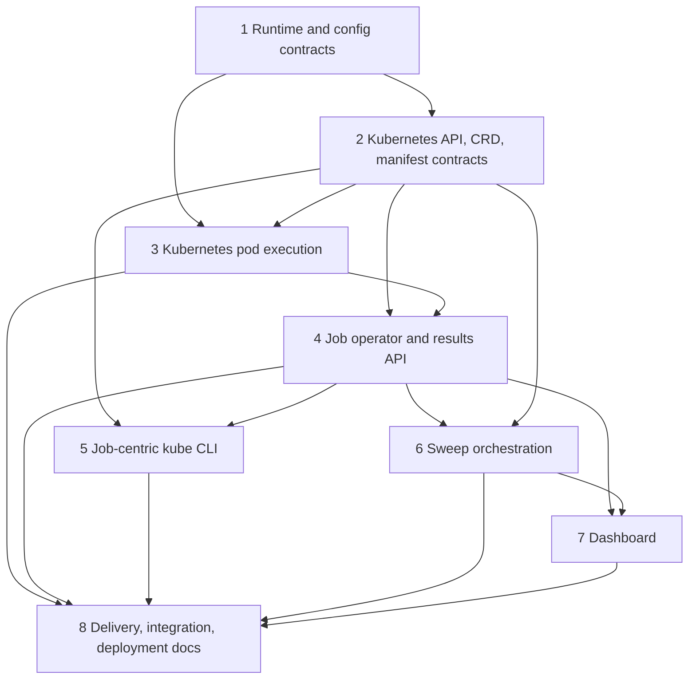

# Kubernetes Port Stacked PRs Design

**Goal:** Replace the single Kubernetes-port commit with eight reviewable pull requests whose final tree exactly reproduces the current branch.

## Source and safety rules

- Reconstruction base: `260d00f5e9` (`origin/main`).
- Preserve `ajc/k8s-clean-port` unchanged as the comparison and recovery branch.
- PR 1 targets `main`; every later PR targets the previous stack branch.
- Create new `ajc/k8s-*` branches only. Do not force-push or rewrite the existing branch.
- Each PR carries its focused tests and behavior-specific documentation. Generated artifacts stay with their source.
- Intermediate PRs must import and pass their focused test suite. Full cluster deployment is deferred to the final delivery PR.

## Dependency model

The non-obvious edges determine the order:

- `config.loader.helpers` and `common.subprocess_models` dynamically import small worker contracts. Put those worker contracts in PR 1 rather than leaving a reverse dependency unresolved.
- The operator is the largest Kubernetes API consumer, so clients, schema, validation, and manifest primitives must exist first.
- `sweep_controller.k8s_executor` imports `OperatorEnvironment`; sweep completion and archival are operator-owned. Sweeps follow the job operator.
- The dashboard renders both jobs and sweeps, so it follows their stable API surfaces.

## PR 1 — Runtime and configuration contracts

**Branch:** `ajc/k8s-runtime-contracts`
**Base:** `origin/main`

**Includes:** distributed-runtime-neutral changes under `common`, config/runtime and deployment models, Kubernetes plugin enum/registry support, new messages/models/enums/mixins, service registry and error queue, health server, subprocess lifecycle, credential redaction/rehydration, monotonic clock, pod lifecycle structures, ZMQ hardening, and the worker scaling/group-runtime contract modules needed by config/common.

**Excludes:** Kubernetes client/CRD code, worker pod lifecycle, operator, CLI, Helm, dashboard.

**Gate:** focused common/config/property tests and local multiprocessing behavior remain green.

## PR 2 — Kubernetes API, CRD, and manifest contracts

**Branch:** `ajc/k8s-api-contracts`
**Base:** `ajc/k8s-runtime-contracts`

**Includes:** `aiperf.kubernetes` constants, environment, async `k8s_client`, selectors, typed references/models, JobSet helpers, retry/subprocess/port-forward/console primitives; `AIPerfJob` and `AIPerfSweep` schemas, validation, spec conversion, serialized-run and result-sidecar contracts; pod/deployment template construction; CRD generator and generated CRDs.

**Excludes:** kopf handlers, WorkerGroupManager, user-facing kube commands, and sweep execution.

**Gate:** CRD generation `--check`, schema/CEL/manifest validation tests, and client-close tests pass.

## PR 3 — Kubernetes pod execution

**Branch:** `ajc/k8s-pod-runtime`
**Base:** `ajc/k8s-api-contracts`

**Includes:** `KubernetesServiceManager`, controller routing and pod monitoring, WorkerGroupManager and group coordination, worker pod startup/registration, dataset and tokenizer delivery, artifact uploads, clock-offset tracking, and RAW finalization/results-ready behavior.

**Excludes:** kopf operator, dashboard/API presentation, sweep orchestration, user CLI.

**Gate:** controller and worker pod-runtime tests pass without a live cluster; Kubernetes execution is selected only for the Kubernetes service-run type.

## PR 4 — Job operator and results API

**Branch:** `ajc/k8s-operator-core`
**Base:** `ajc/k8s-pod-runtime`

**Includes:** kopf entrypoint, environment/metrics, client cache, job create/monitor/lifecycle/cleanup/completion/restart/JobSet-terminal handlers, status builder, progress client, durable completion claims, cancellation/fencing/recovery, result layout/index/archive, and job-centric results-server routers.

**Excludes:** AIPerfSweep handlers/controller behavior and static dashboard assets.

**Gate:** job operator and results API tests pass; index bootstrap remains resilient to missing or stale disk state.

## PR 5 — Job-centric Kubernetes CLI

**Branch:** `ajc/k8s-cli`
**Base:** `ajc/k8s-operator-core`

**Includes:** kube Typer app/shared options and job-centric init, generate, validate, preflight, setup/deploy, profile, logs, attach, results, debug, list/show/delete/cancel/cleanup, dashboard/proxy/shutdown flows; text/JSON output behavior; generated CLI/environment docs and associated user guides.

**Excludes:** sweep submit/list/result selection behavior.

**Gate:** lazy import, generation/validation, JSON output, and mocked client CLI tests pass.

## PR 6 — Sweep orchestration

**Branch:** `ajc/k8s-sweeps`
**Base:** `ajc/k8s-cli`

**Includes:** sweep-controller plan builder/executor/status writer/aggregation/naming/cancellation/restart, operator sweep create/lifecycle/child-rollup/aggregate-fetch, sweep-specific index/results routes, sweep CLI selectors/command, tests, and Kubernetes sweep docs.

**Gate:** child name/index derivation, parent status rollup, cancellation, aggregate harvest, and adaptive-restart tests pass. Child AIPerfJobs retain parent UID and epoch fencing.

## PR 7 — Dashboard

**Branch:** `ajc/k8s-dashboard`
**Base:** `ajc/k8s-sweeps`

**Includes:** dependency injection, WebSocket/pod-state transport, dashboard-server/static serving, shared API schemas, static-v2 assets, dashboard tests and accessibility checks, and dashboard documentation.

**Gate:** dashboard server/router and static UI correctness tests pass for live and archived job and sweep views.

## PR 8 — Delivery, integration, and deployment documentation

**Branch:** `ajc/k8s-delivery-docs`
**Base:** `ajc/k8s-dashboard`

**Includes:** Helm chart, Dockerfile, Makefile, package metadata/lockfile/attributions, chart tooling, CI workflows, dev cluster fixtures/utilities, Kubernetes integration/component/chaos/audit tests, and cross-cutting deployment, production, security, monitoring, API, and tutorial docs not owned by earlier behavior.

**Gate:** Helm lint/template, chart consistency, CRD consistency, image build, and supported integration/chaos/audit suites pass.

## Reconstruction procedure

1. Create PR 1 from `260d00f5e9`; stage only its files and behavior-specific hunks, then commit.
2. Branch each successor from its predecessor. Partition mixed files by patch staging, not directory alone.
3. Run each PR gate before creating its successor; re-run import tests after every boundary.
4. After PR 8, compare its complete tree to `ajc/k8s-clean-port`. Reconcile every source, test, generated, deployment, and documentation file. Any intentional correction requires a dedicated commit message.
5. Push the new branches, open each PR against its stated base, and link predecessors/successors in every PR description.

## Non-goals

- No behavior changes, unrelated refactors, or dependency upgrades.
- No rewrite, deletion, or force-push of `ajc/k8s-clean-port`.
- No claim that intermediate PRs provide a complete cluster deployment; their contract boundaries are the verification target.
