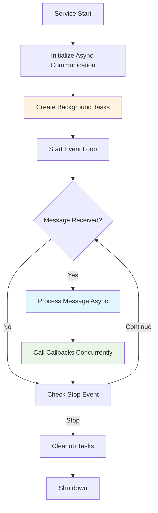

<!--
#  SPDX-FileCopyrightText: Copyright (c) 2025 NVIDIA CORPORATION & AFFILIATES. All rights reserved.
#  SPDX-License-Identifier: Apache-2.0
#
#  Licensed under the Apache License, Version 2.0 (the "License");
#  you may not use this file except in compliance with the License.
#  You may obtain a copy of the License at
#
#  http://www.apache.org/licenses/LICENSE-2.0
#
#  Unless required by applicable law or agreed to in writing, software
#  distributed under the License is distributed on an "AS IS" BASIS,
#  WITHOUT WARRANTIES OR CONDITIONS OF ANY KIND, either express or implied.
#  See the License for the specific language governing permissions and
#  limitations under the License.
-->
# Async/Await in AIPerf

**Summary:** AIPerf leverages async/await extensively for non-blocking I/O operations, enabling efficient concurrent handling of ZMQ messaging, service communication, and background tasks.

## Overview

Async/await is fundamental to AIPerf's architecture, enabling non-blocking I/O and concurrency throughout the system. The framework uses asyncio extensively for managing ZMQ communication patterns, service lifecycle management, and background task execution. This allows AIPerf to handle multiple concurrent operations efficiently without blocking the main execution thread.

## Key Concepts

- **Coroutines**: Functions defined with `async def` that can be suspended and resumed
- **Event Loop Integration**: All services run within asyncio event loops for coordinated execution
- **Non-blocking I/O**: ZMQ socket operations use async variants to prevent blocking
- **Task Management**: Background tasks are managed using `asyncio.create_task()`
- **Concurrent Execution**: Multiple services and operations run concurrently without interference

## Practical Example

```python
# ZMQ Communication with async/await
class ZMQSubClient(BaseZMQClient):
    @aiperf_task
    async def _sub_receiver(self) -> None:
        """Background task for receiving messages from subscribed topics."""
        while not self.is_shutdown:
            try:
                # Non-blocking receive operation
                topic_bytes, message_bytes = await self.socket.recv_multipart()
                topic = topic_bytes.decode()
                message_json = message_bytes.decode()

                # Parse and handle message asynchronously
                message = BaseMessage.model_validate_json(message_json)

                # Call callbacks concurrently
                if topic in self._subscribers:
                    await call_all_functions(self._subscribers[topic], message)

            except asyncio.CancelledError:
                break
            except Exception as e:
                logger.error(f"Exception in receiver: {e}")
                await asyncio.sleep(0.1)

# Service lifecycle management
class BaseService:
    async def initialize(self) -> None:
        """Initialize service with async operations."""
        await self.communication.initialize()
        await self._run_hooks(AIPerfHooks.INIT)

    async def run_forever(self) -> None:
        """Run service indefinitely with async event loop."""
        while not self.stop_event.is_set():
            await self._forever_loop()
            await asyncio.sleep(0.1)
```

## Visual Diagram



## Best Practices and Pitfalls

**Best Practices:**
- Use `async def` for all I/O-bound operations (ZMQ, file operations)
- Leverage `asyncio.create_task()` for concurrent background operations
- Always handle `asyncio.CancelledError` in long-running tasks
- Use `await asyncio.sleep(0.1)` for graceful error recovery loops

**Common Pitfalls:**
- Mixing synchronous and asynchronous code without proper handling
- Forgetting to await coroutines, leading to unawaited coroutine warnings
- Using blocking operations in async functions (use async alternatives)
- Not handling task cancellation properly during shutdown

## Discussion Points

- How does AIPerf's async architecture improve performance compared to synchronous alternatives?
- What are the trade-offs between using async/await vs threading for concurrent operations?
- How can we ensure proper error handling and resource cleanup in async service architectures?
