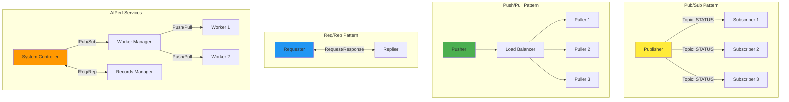

<!--
#  SPDX-FileCopyrightText: Copyright (c) 2025 NVIDIA CORPORATION & AFFILIATES. All rights reserved.
#  SPDX-License-Identifier: Apache-2.0
-->
# ZeroMQ (ZMQ) Messaging Patterns

**Summary:** AIPerf uses ZeroMQ for high-performance, asynchronous messaging between distributed services, implementing pub/sub, push/pull, and req/rep patterns for different communication needs.

## Overview

ZeroMQ serves as the backbone of AIPerf's distributed communication system, providing reliable, high-performance messaging between services. The framework implements multiple ZMQ patterns to handle different communication scenarios: pub/sub for broadcasting, push/pull for load balancing, and req/rep for synchronous communication. This design enables scalable, fault-tolerant service coordination.

## Key Concepts

- **Pub/Sub Pattern**: One-to-many broadcasting for status updates and notifications
- **Push/Pull Pattern**: Load-balanced work distribution across multiple workers
- **Req/Rep Pattern**: Synchronous request-response communication
- **Socket Types**: Different socket types for specific communication patterns
- **Transport Protocols**: TCP-based communication with configurable ports
- **Message Serialization**: JSON-based message serialization using Pydantic models

## Practical Example

```python
# ZMQ Communication Configuration
class ZMQTCPTransportConfig(BaseModel):
    host: str = "0.0.0.0"
    controller_pub_sub_port: int = 5555
    component_pub_sub_port: int = 5556
    inference_push_pull_port: int = 5557
    req_rep_port: int = 5558

# Publisher Pattern - Broadcasting status updates
class ZMQPubClient(BaseZMQClient):
    async def publish(self, topic: str, message: Message) -> None:
        """Publish message to all subscribers of a topic."""
        message_json = message.model_dump_json()
        await self.socket.send_multipart([
            topic.encode(),
            message_json.encode()
        ])

# Subscriber Pattern - Receiving broadcasts
class ZMQSubClient(BaseZMQClient):
    async def subscribe(self, topic: str, callback: Callable) -> None:
        """Subscribe to topic and register callback."""
        self.socket.subscribe(topic.encode())
        if topic not in self._subscribers:
            self._subscribers[topic] = []
        self._subscribers[topic].append(callback)

# Push/Pull Pattern - Work distribution
class ZMQPushClient(BaseZMQClient):
    async def push(self, message: Message) -> None:
        """Push work to available workers."""
        data_json = message.model_dump_json()
        await self.socket.send_string(data_json)

class ZMQPullClient(BaseZMQClient):
    async def pull(self, topic: str, callback: Callable) -> None:
        """Pull work from queue and process."""
        if topic not in self._pull_callbacks:
            self._pull_callbacks[topic] = []
        self._pull_callbacks[topic].append(callback)

# Request/Reply Pattern - Synchronous communication
class ZMQReqClient(BaseZMQClient):
    async def request(self, target: str, request_data: Message, timeout: float = 5.0) -> Message:
        """Send request and wait for response."""
        request_json = request_data.model_dump_json()
        await self.socket.send_string(request_json)

        # Wait for response with timeout
        response_json = await asyncio.wait_for(
            self.socket.recv_string(), timeout
        )
        return BaseMessage.model_validate_json(response_json)
```

## Visual Diagram



## Best Practices and Pitfalls

**Best Practices:**
- Use pub/sub for broadcasting events and status updates
- Implement push/pull for distributing work across multiple workers
- Apply req/rep sparingly for critical synchronous operations
- Set appropriate socket timeouts (30s for send/receive operations)
- Handle `zmq.Again` exceptions for non-blocking operations
- Use proper topic naming conventions for message routing

**Common Pitfalls:**
- Forgetting to subscribe to topics before expecting messages
- Not handling socket timeouts properly in async operations
- Creating too many req/rep connections (can cause blocking)
- Missing error handling for network disconnections
- Improper socket cleanup leading to resource leaks

## Discussion Points

- How do different ZMQ patterns affect system scalability and fault tolerance?
- What are the trade-offs between using ZMQ vs other messaging systems like RabbitMQ or Kafka?
- How can we implement proper backpressure handling in push/pull patterns?
