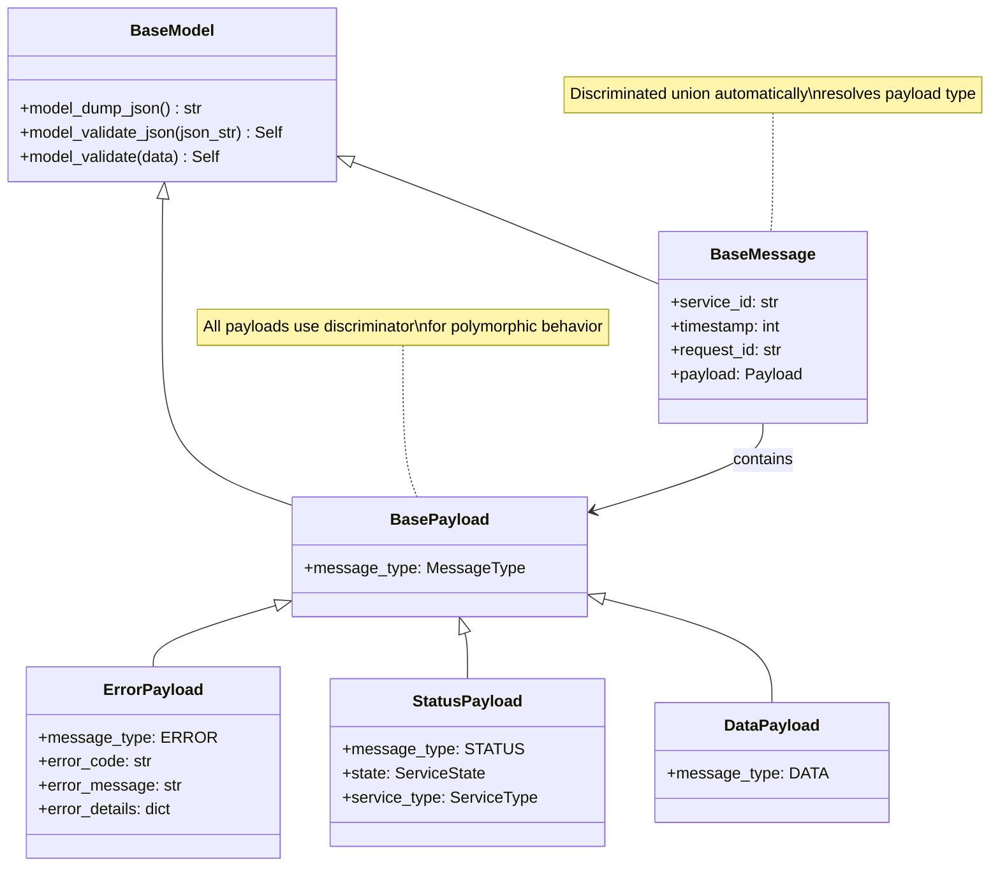

<!--
#  SPDX-FileCopyrightText: Copyright (c) 2025 NVIDIA CORPORATION & AFFILIATES. All rights reserved.
#  SPDX-License-Identifier: Apache-2.0
-->
# Pydantic for Data Validation

**Summary:** AIPerf extensively uses Pydantic for robust data validation, serialization, and type safety across all message payloads, configuration models, and service interfaces.

## Overview

Pydantic is central to AIPerf's data handling strategy, providing automatic validation, serialization, and type safety throughout the system. Every message, configuration, and data structure is defined as a Pydantic model, ensuring data integrity and enabling seamless JSON serialization for ZMQ communication. This approach eliminates runtime type errors and provides clear data contracts between services.

## Key Concepts

- **BaseModel Inheritance**: All data structures inherit from `pydantic.BaseModel`
- **Automatic Validation**: Input data is automatically validated against field types and constraints
- **JSON Serialization**: Built-in `model_dump_json()` and `model_validate_json()` methods
- **Discriminated Unions**: Using discriminators for polymorphic message types
- **Field Validation**: Custom validators and constraints using `Field()`
- **Generic Models**: Type-safe generic models for reusable patterns

## Practical Example

```python
# Base payload with discriminated union pattern
class BasePayload(BaseModel):
    """Base model for all payload data with discriminator support."""
    message_type: Literal[MessageType.UNKNOWN] = Field(
        ..., description="Type of message this payload represents"
    )

# Specific payload types with discriminators
class ErrorPayload(BasePayload):
    message_type: Literal[MessageType.ERROR] = MessageType.ERROR
    error_code: str | None = Field(default=None, description="Exception code")
    error_message: str | None = Field(default=None, description="Exception message")
    error_details: dict[str, Any] | None = Field(
        default=None, description="Additional error details"
    )

class DataPayload(BasePayload):
    message_type: Literal[MessageType.DATA] = MessageType.DATA

class StatusPayload(BasePayload):
    message_type: Literal[MessageType.STATUS] = MessageType.STATUS
    state: ServiceState = Field(..., description="Current state of the service")
    service_type: ServiceType = Field(..., description="Type of service")

# Discriminated union for automatic type resolution
Payload = Annotated[
    Union[ErrorPayload, DataPayload, StatusPayload, HeartbeatPayload,
          RegistrationPayload, CommandPayload, CreditDropPayload, CreditReturnPayload],
    Field(discriminator="message_type")
]

# Message container with automatic payload type resolution
class BaseMessage(BaseModel):
    """Base message model with polymorphic payload support."""
    service_id: str | None = Field(default=None, description="Service ID")
    timestamp: int = Field(default_factory=time.time_ns, description="Timestamp")
    request_id: str | None = Field(default=None, description="Request ID")
    payload: Payload = Field(..., description="Message payload")

# Configuration models with validation
class ZMQTCPTransportConfig(BaseModel):
    host: str = Field(default="0.0.0.0", description="Host address")
    controller_pub_sub_port: int = Field(
        default=5555, description="Port for controller pub/sub messages"
    )
    component_pub_sub_port: int = Field(
        default=5556, description="Port for component pub/sub messages"
    )

# Generic models for type safety
class BackendClientConfig(BaseModel, Generic[ConfigT]):
    """Generic configuration for backend clients."""
    backend_client_type: BackendClientType | str = Field(
        ..., description="Type of backend client"
    )
    client_config: ConfigT = Field(..., description="Client-specific configuration")

# Usage example with automatic validation and serialization
message = BaseMessage(
    service_id="worker-1",
    payload=StatusPayload(
        state=ServiceState.RUNNING,
        service_type=ServiceType.WORKER
    )
)

# Automatic JSON serialization
json_string = message.model_dump_json()

# Automatic deserialization with type validation
deserialized = BaseMessage.model_validate_json(json_string)
# Type is automatically resolved to StatusPayload
assert isinstance(deserialized.payload, StatusPayload)
```

## Visual Diagram



## Best Practices and Pitfalls

**Best Practices:**
- Use `Field()` with descriptive documentation for all model fields
- Leverage discriminated unions for polymorphic data structures
- Implement custom validators for complex business logic validation
- Use generic models (`Generic[T]`) for reusable, type-safe patterns
- Prefer `model_dump_json()` and `model_validate_json()` for serialization
- Use `Literal` types for discriminator fields to ensure type safety

**Common Pitfalls:**
- Forgetting to set discriminator values correctly in subclasses
- Using mutable default values (use `default_factory` instead)
- Not handling validation errors properly when deserializing external data
- Overusing complex validators when simple type annotations suffice
- Missing `Field()` descriptions for API documentation generation

## Discussion Points

- How does Pydantic's discriminated union pattern improve message handling compared to manual type checking?
- What are the performance implications of automatic validation in high-throughput scenarios?
- How can we balance strict validation with flexibility for evolving data schemas?
