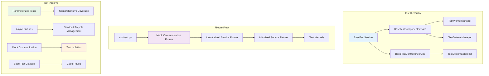

<!--
#  SPDX-FileCopyrightText: Copyright (c) 2025 NVIDIA CORPORATION & AFFILIATES. All rights reserved.
#  SPDX-License-Identifier: Apache-2.0
-->
# Pytest: Testing Strategies

**Summary:** AIPerf employs comprehensive pytest strategies including async fixtures, parameterization, mocking, and inheritance-based test patterns to ensure robust testing of distributed services.

## Overview

AIPerf's testing strategy leverages pytest's advanced features to handle the complexity of testing asynchronous, distributed services. The framework uses a hierarchical test structure with base test classes, async fixtures for service lifecycle management, extensive mocking for isolation, and parameterized tests for comprehensive coverage. This approach ensures reliable testing while maintaining test performance and clarity.

## Key Concepts

- **Async Test Support**: Using `@pytest.mark.asyncio` for testing async functions
- **Fixture Hierarchy**: Base fixtures inherited by specific service tests
- **Parameterized Testing**: Testing multiple scenarios with `@pytest.mark.parametrize`
- **Mock Communication**: Isolated testing using mock ZMQ communication
- **Test Inheritance**: Base test classes providing common test patterns
- **Async Fixtures**: Managing async service lifecycle in tests

## Practical Example

```python
# Base test class with common patterns
@pytest.mark.asyncio
class BaseTestService(ABC):
    """Base test class for all service tests."""

    @pytest.fixture(autouse=True)
    def no_sleep(self, monkeypatch) -> None:
        """Patch asyncio.sleep to prevent test delays."""
        monkeypatch.setattr(asyncio, "sleep", async_noop)

    @pytest.fixture(autouse=True)
    def patch_communication_factory(self, mock_communication: MagicMock) -> Generator:
        """Patch communication factory for isolation."""
        with patch(
            "aiperf.common.comms.base.CommunicationFactory.create_communication",
            return_value=mock_communication,
        ):
            yield

    @pytest.fixture
    async def initialized_service(
        self, uninitialized_service: BaseService, mock_communication: MagicMock
    ) -> AsyncGenerator[BaseService, None]:
        """Create and initialize service for testing."""
        service = await async_fixture(uninitialized_service)
        await service.initialize()
        yield service

# Parameterized testing for comprehensive coverage
@pytest.mark.parametrize(
    "expected_image_size",
    [(100, 100), (200, 200), (512, 512)]
)
def test_different_image_sizes(expected_image_size):
    """Test image generation with different sizes."""
    width, height = expected_image_size
    base64_string = ImageGenerator.create_synthetic_image(
        image_width_mean=width,
        image_width_stddev=0,
        image_height_mean=height,
        image_height_stddev=0,
        image_format=ImageFormat.JPEG,
    )
    image = decode_image(base64_string)
    assert image.size == expected_image_size

# State transition testing with parameterization
@pytest.mark.parametrize(
    "state",
    [state for state in ServiceState if state != ServiceState.UNKNOWN],
)
@pytest.mark.asyncio
async def test_service_state_transitions(
    self, initialized_service: BaseService, state: ServiceState
) -> None:
    """Test service can transition to all possible states."""
    service = await async_fixture(initialized_service)
    await service.set_state(state)
    assert service.state == state

# Mock communication for isolated testing
@pytest.fixture
def mock_zmq_communication() -> MagicMock:
    """Create mock communication with tracked interactions."""
    mock_comm = MagicMock(spec=ZMQCommunication)
    mock_comm.mock_data = MockCommunicationData()

    async def mock_publish(topic: Topic, message: Message) -> None:
        if topic not in mock_comm.mock_data.published_messages:
            mock_comm.mock_data.published_messages[topic] = []
        mock_comm.mock_data.published_messages[topic].append(message)

    mock_comm.publish.side_effect = mock_publish
    return mock_comm

# Service-specific test class inheriting common patterns
@pytest.mark.asyncio
class TestWorkerManager(BaseTestComponentService):
    """Tests for worker manager service."""

    @pytest.fixture
    def service_class(self) -> type[BaseService]:
        """Return the service class to be tested."""
        return WorkerManager

    async def test_worker_manager_initialization(
        self, initialized_service: WorkerManager
    ) -> None:
        """Test worker manager specific initialization."""
        service = await async_fixture(initialized_service)
        assert service.service_type == ServiceType.WORKER_MANAGER
        assert hasattr(service, "workers")
        assert service.cpu_count == multiprocessing.cpu_count()

# Async utility for manual fixture awaiting
async def async_fixture(fixture: T) -> T:
    """Manually await an async pytest fixture."""
    if hasattr(fixture, "__aiter__"):
        with contextlib.suppress(StopAsyncIteration):
            async_gen = cast(AsyncIterator[Any], fixture)
            value = await anext(async_gen)
            return cast(T, value)
    return fixture

# Complex parameterized testing with multiple variables
@pytest.mark.parametrize(
    "width_mean, width_stddev, height_mean, height_stddev",
    [
        (100, 15, 100, 15),
        (123, 10, 456, 7),
        (512, 50, 256, 25),
    ],
)
def test_generator_deterministic(width_mean, width_stddev, height_mean, height_stddev):
    """Test deterministic behavior with multiple parameters."""
    random.seed(123)
    img1 = ImageGenerator.create_synthetic_image(
        image_width_mean=width_mean,
        image_width_stddev=width_stddev,
        image_height_mean=height_mean,
        image_height_stddev=height_stddev,
        image_format=ImageFormat.PNG,
    )

    random.seed(123)  # Reset seed for deterministic comparison
    img2 = ImageGenerator.create_synthetic_image(
        image_width_mean=width_mean,
        image_width_stddev=width_stddev,
        image_height_mean=height_mean,
        image_height_stddev=height_stddev,
        image_format=ImageFormat.PNG,
    )

    assert img1 == img2, "Generator should be deterministic with same seed"
```

## Visual Diagram



## Best Practices and Pitfalls

**Best Practices:**
- Use `@pytest.mark.asyncio` for all async test methods
- Leverage `autouse=True` fixtures for common setup (like patching sleep)
- Create base test classes to share common test patterns across services
- Use parameterization extensively to test multiple scenarios efficiently
- Mock external dependencies (ZMQ, file I/O) for test isolation
- Implement async fixtures for complex service lifecycle management
- Use descriptive test names that clearly indicate what is being tested

**Common Pitfalls:**
- Forgetting to await async fixtures with `async_fixture()` helper
- Not properly mocking async dependencies leading to real network calls
- Creating overly complex parameterized tests that are hard to debug
- Missing cleanup in async fixtures causing resource leaks
- Not using `monkeypatch` for temporary modifications during tests
- Inadequate isolation between tests causing flaky test behavior

## Discussion Points

- How does the inheritance-based test structure improve maintainability compared to standalone test functions?
- What are the trade-offs between comprehensive mocking and integration testing in distributed systems?
- How can we ensure test performance while maintaining thorough coverage of async service interactions?
