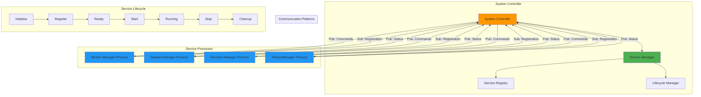

<!--
#  SPDX-FileCopyrightText: Copyright (c) 2025 NVIDIA CORPORATION & AFFILIATES. All rights reserved.
#  SPDX-License-Identifier: Apache-2.0
-->
# System Controller Architecture

**Summary:** The System Controller serves as the central orchestrator in AIPerf, managing service lifecycle, coordinating distributed components, and maintaining system state through ZMQ communication patterns.

## Overview

The System Controller is the heart of AIPerf's distributed architecture, acting as the central coordinator for all services in the system. It manages service registration, lifecycle events, state transitions, and inter-service communication. The controller uses a combination of pub/sub for broadcasting system events and req/rep for direct service communication, ensuring reliable coordination across the distributed system.

## Key Concepts

- **Central Orchestration**: Single point of control for system-wide operations
- **Service Registry**: Maintains registry of all active services and their states
- **Lifecycle Management**: Coordinates service initialization, startup, and shutdown
- **State Coordination**: Manages and broadcasts system state changes
- **Multi-Process Management**: Handles service processes across multiple cores
- **Event Broadcasting**: Uses pub/sub pattern for system-wide notifications

## Practical Example

```python
# System Controller with service management
class SystemController(BaseControllerService):
    """Central controller for managing AIPerf services."""

    def __init__(self, service_config: ServiceConfig) -> None:
        super().__init__(service_config)
        self.service_manager: MultiProcessServiceManager | None = None
        self.required_services = [
            ServiceType.WORKER_MANAGER,
            ServiceType.DATASET_MANAGER,
            ServiceType.RECORDS_MANAGER,
            ServiceType.TIMING_MANAGER
        ]

    @on_init
    async def _initialize_service_manager(self) -> None:
        """Initialize the multi-process service manager."""
        self.service_manager = MultiProcessServiceManager(
            required_service_types=self.required_services,
            config=self.service_config
        )
        await self.service_manager.initialize()

    @on_start
    async def _start_all_services(self) -> None:
        """Start all required services."""
        if self.service_manager:
            await self.service_manager.start_all_services()
            await self.service_manager.wait_for_all_services_registration()
            await self.service_manager.wait_for_all_services_start()

    @on_stop
    async def _stop_all_services(self) -> None:
        """Stop all managed services."""
        if self.service_manager:
            await self.service_manager.stop_all_services()

# Multi-Process Service Manager
class MultiProcessServiceManager:
    """Manages services across multiple processes."""

    def __init__(
        self,
        required_service_types: list[ServiceType],
        config: ServiceConfig
    ) -> None:
        self.required_service_types = required_service_types
        self.config = config
        self.processes: dict[ServiceType, Process] = {}
        self.service_registry: dict[str, ServiceRunInfo] = {}

    async def start_all_services(self) -> None:
        """Start all required services in separate processes."""
        for service_type in self.required_service_types:
            process = Process(
                target=self._run_service_process,
                args=(service_type, self.config)
            )
            process.start()
            self.processes[service_type] = process

    async def wait_for_all_services_registration(self) -> None:
        """Wait for all services to register with the controller."""
        registered_services = set()

        while len(registered_services) < len(self.required_service_types):
            # Listen for registration messages
            for service_type in self.required_service_types:
                if service_type not in registered_services:
                    # Check if service has registered
                    if self._is_service_registered(service_type):
                        registered_services.add(service_type)
                        logger.info(f"Service {service_type} registered")

            await asyncio.sleep(0.1)

    def _run_service_process(self, service_type: ServiceType, config: ServiceConfig) -> None:
        """Run a service in a separate process."""
        service_class = ServiceFactory.get_service_class(service_type)
        service = service_class(service_config=config)

        # Run the service event loop
        asyncio.run(service.run_forever())

# Service registration and state management
class BaseService:
    """Base service with controller communication."""

    async def register_with_controller(self) -> None:
        """Register this service with the system controller."""
        registration_message = RegistrationMessage(
            service_id=self.service_id,
            payload=RegistrationPayload(
                service_type=self.service_type,
                state=ServiceState.READY
            )
        )

        await self.communication.publish(
            Topic.REGISTRATION,
            registration_message
        )

    async def set_state(self, new_state: ServiceState) -> None:
        """Update service state and notify controller."""
        old_state = self.state
        self.state = new_state

        # Broadcast state change
        status_message = StatusMessage(
            service_id=self.service_id,
            payload=StatusPayload(
                state=new_state,
                service_type=self.service_type
            )
        )

        await self.communication.publish(Topic.STATUS, status_message)
        await self._run_hooks(AIPerfHooks.SET_STATE, new_state)

        logger.info(f"Service {self.service_id} state: {old_state} -> {new_state}")

# Command handling for service coordination
@on_command(CommandType.START)
async def handle_start_command(self, command: CommandPayload) -> None:
    """Handle start command from controller."""
    await self.set_state(ServiceState.STARTING)
    await self.start()
    await self.set_state(ServiceState.RUNNING)

@on_command(CommandType.STOP)
async def handle_stop_command(self, command: CommandPayload) -> None:
    """Handle stop command from controller."""
    await self.set_state(ServiceState.STOPPING)
    await self.stop()
    await self.set_state(ServiceState.STOPPED)
```

## Visual Diagram



## Best Practices and Pitfalls

**Best Practices:**
- Implement robust service registration with timeout handling
- Use pub/sub for broadcasting system-wide events and commands
- Maintain comprehensive service registry with health monitoring
- Implement graceful shutdown procedures for all managed services
- Use process isolation to prevent service failures from affecting others
- Provide clear service lifecycle state transitions with proper logging

**Common Pitfalls:**
- Not handling service registration timeouts properly
- Missing error handling for failed service processes
- Inadequate cleanup during system shutdown
- Race conditions in service startup coordination
- Not monitoring service health after initial registration
- Blocking operations in the controller affecting system responsiveness

## Discussion Points

- How does the centralized controller approach compare to peer-to-peer service coordination?
- What strategies can be implemented to handle controller failure and ensure system resilience?
- How can we balance centralized control with service autonomy for optimal performance?
