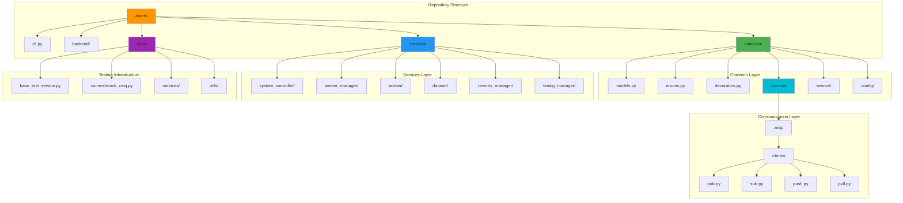

<!--
#  SPDX-FileCopyrightText: Copyright (c) 2025 NVIDIA CORPORATION & AFFILIATES. All rights reserved.
#  SPDX-License-Identifier: Apache-2.0
-->
# Repository Structure and Organization

**Summary:** AIPerf follows a well-organized, modular structure with clear separation of concerns, enabling maintainable development and easy navigation across backend clients, services, common utilities, and testing infrastructure.

## Overview

AIPerf's repository structure is designed for scalability and maintainability, following Python best practices and domain-driven design principles. The codebase is organized into distinct modules with clear responsibilities: common utilities for shared functionality, services for distributed components, backend clients for external integrations, and comprehensive testing infrastructure. This structure supports both development efficiency and deployment flexibility.

## Key Concepts

- **Modular Architecture**: Clear separation between common utilities, services, and backends
- **Domain-Driven Design**: Services organized by business domain (workers, datasets, records)
- **Layered Structure**: Common layer provides foundation for higher-level services
- **Configuration Management**: Centralized configuration with environment-specific overrides
- **Testing Infrastructure**: Comprehensive test organization mirroring production structure
- **Development Tooling**: Integrated linting, formatting, and CI/CD configuration

## Practical Example

```python
# Repository Structure Overview
aiperf/
├── __init__.py                    # Package initialization and version
├── cli.py                         # Command-line interface entry point
├── backend/                       # External service integrations
│   ├── __init__.py
│   ├── client_factory.py         # Factory pattern for backend clients
│   ├── client_mixins.py          # Shared client functionality
│   └── openai_client.py          # OpenAI API integration
├── common/                        # Shared utilities and base classes
│   ├── __init__.py
│   ├── models.py                  # Pydantic data models
│   ├── enums.py                   # System-wide enumerations
│   ├── interfaces.py              # Protocol definitions
│   ├── decorators.py              # Hook system decorators
│   ├── exceptions.py              # Custom exception hierarchy
│   ├── utils.py                   # Utility functions
│   ├── types.py                   # Type aliases and generics
│   ├── base_metaclass.py          # Metaclass implementations
│   ├── bootstrap.py               # System initialization
│   ├── tokenizer.py               # Text tokenization utilities
│   ├── comms/                     # Communication layer
│   │   ├── __init__.py
│   │   ├── base.py               # Abstract communication interface
│   │   ├── client_enums.py       # Communication client types
│   │   └── zmq/                  # ZeroMQ implementation
│   │       ├── __init__.py
│   │       ├── zmq_comms.py      # Main ZMQ communication class
│   │       └── clients/          # ZMQ client implementations
│   │           ├── base.py       # Base ZMQ client
│   │           ├── pub.py        # Publisher client
│   │           ├── sub.py        # Subscriber client
│   │           ├── push.py       # Push client
│   │           ├── pull.py       # Pull client
│   │           ├── req.py        # Request client
│   │           └── rep.py        # Reply client
│   ├── service/                   # Base service infrastructure
│   │   ├── __init__.py
│   │   ├── base_service.py       # Abstract service base class
│   │   └── base_component_service.py  # Component service base
│   └── config/                    # Configuration management
│       ├── __init__.py
│       └── service_config.py     # Service configuration models
├── services/                      # Distributed service implementations
│   ├── __init__.py
│   ├── system_controller/         # Central system orchestrator
│   │   ├── __init__.py
│   │   └── system_controller.py
│   ├── worker_manager/            # Worker coordination service
│   │   ├── __init__.py
│   │   └── worker_manager.py
│   ├── worker/                    # Individual worker processes
│   │   ├── __init__.py
│   │   └── worker.py
│   ├── dataset/                   # Dataset management and generation
│   │   ├── __init__.py
│   │   ├── dataset_manager.py
│   │   └── generator/
│   │       ├── image.py          # Image generation utilities
│   │       ├── audio.py          # Audio generation utilities
│   │       └── prompt.py         # Text prompt generation
│   ├── records_manager/           # Performance data collection
│   │   ├── __init__.py
│   │   └── records_manager.py
│   ├── timing_manager/            # Timing and scheduling coordination
│   │   ├── __init__.py
│   │   └── timing_manager.py
│   ├── post_processor_manager/    # Result processing coordination
│   │   ├── __init__.py
│   │   └── post_processor_manager.py
│   └── service_manager/           # Service lifecycle management
│       ├── __init__.py
│       └── multiprocess_service_manager.py
└── tests/                         # Comprehensive testing infrastructure
    ├── __init__.py
    ├── conftest.py               # Shared test fixtures
    ├── base_test_service.py      # Base test class for services
    ├── base_test_component_service.py  # Component service tests
    ├── utils/                    # Test utilities
    │   ├── __init__.py
    │   └── async_test_utils.py   # Async testing helpers
    ├── comms/                    # Communication layer tests
    │   ├── __init__.py
    │   ├── mock_zmq.py          # ZMQ mocking utilities
    │   └── test_zmq_communication.py
    ├── services/                 # Service-specific tests
    │   ├── test_system_controller.py
    │   ├── test_worker_manager.py
    │   ├── test_worker.py
    │   ├── test_dataset_manager.py
    │   ├── test_records_manager.py
    │   └── test_timing_manager.py
    ├── test_image_generator.py   # Generator testing
    ├── test_audio_generator.py
    └── test_prompt_generator.py

# Configuration and tooling files
├── pyproject.toml                # Project configuration and dependencies
├── .pre-commit-config.yaml       # Code quality automation
├── .gitignore                    # Version control exclusions
├── Makefile                      # Development automation
├── Dockerfile                    # Container deployment
├── mkdocs.yml                    # Documentation configuration
├── README.md                     # Project overview
└── LICENSE                       # Legal licensing

# Import organization example
# aiperf/common/__init__.py
from aiperf.common.enums import ServiceType, ServiceState, MessageType
from aiperf.common.models import BaseMessage, StatusPayload, ErrorPayload
from aiperf.common.decorators import on_init, on_start, on_stop, aiperf_task
from aiperf.common.exceptions import (
    CommunicationError,
    ServiceInitializationError,
    ConfigurationError
)

# aiperf/services/__init__.py
from aiperf.services.system_controller import SystemController
from aiperf.services.worker_manager import WorkerManager
from aiperf.services.worker import Worker
from aiperf.services.dataset import DatasetManager

# Clean import paths for users
from aiperf import (
    SystemController,
    WorkerManager,
    ServiceType,
    ServiceState
)
```

## Visual Diagram



## Best Practices and Pitfalls

**Best Practices:**
- Follow consistent naming conventions across all modules
- Use `__init__.py` files to control public API exposure
- Organize imports logically with clear dependency hierarchies
- Maintain parallel structure between source and test directories
- Use configuration files for environment-specific settings
- Document module purposes and relationships clearly
- Implement proper dependency injection patterns

**Common Pitfalls:**
- Creating circular imports between modules
- Mixing business logic with infrastructure concerns
- Inconsistent module organization across similar components
- Missing `__init__.py` files breaking package imports
- Overly deep directory nesting making navigation difficult
- Unclear separation between public and private APIs
- Inadequate documentation of module relationships

## Discussion Points

- How does the current structure support both monolithic and microservice deployment patterns?
- What are the trade-offs between deep directory hierarchies and flatter structures?
- How can we ensure consistent organization as the codebase grows and new services are added?
