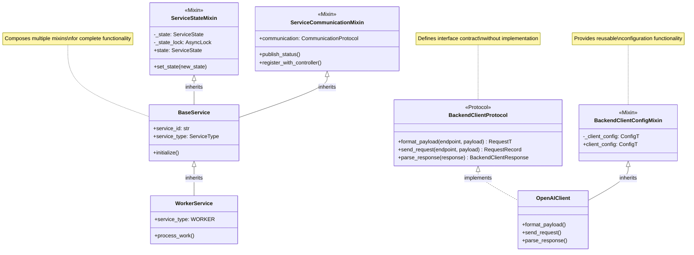

<!--
#  SPDX-FileCopyrightText: Copyright (c) 2025 NVIDIA CORPORATION & AFFILIATES. All rights reserved.
#  SPDX-License-Identifier: Apache-2.0
-->
# Protocols and Mixins

**Summary:** AIPerf uses Python protocols for type-safe interfaces and mixins for shared functionality, enabling flexible composition and clear contracts between components while maintaining type safety.

## Overview

AIPerf leverages Python's Protocol system and mixin classes to create flexible, composable architectures with strong type safety. Protocols define clear interfaces for backend clients and communication layers, while mixins provide reusable functionality that can be composed into different service types. This approach enables duck typing with static type checking and promotes code reuse without complex inheritance hierarchies.

## Key Concepts

- **Protocol Interfaces**: Type-safe contracts using `typing.Protocol`
- **Mixin Composition**: Reusable functionality through multiple inheritance
- **Duck Typing**: Structural subtyping for flexible implementations
- **Generic Protocols**: Type-safe interfaces with generic type parameters
- **Interface Segregation**: Small, focused protocols for specific capabilities
- **Composition over Inheritance**: Building complex behavior from simple components

## Practical Example

```python
# Protocol definitions for type-safe interfaces
from typing import Protocol, Generic, TYPE_CHECKING
from aiperf.common.types import ConfigT, RequestT, ResponseT

class BackendClientConfigProtocol(Protocol):
    """Protocol for backend client configuration."""

    def __init__(self, client_config: "BackendClientConfig[ConfigT]") -> None:
        """Create a new backend client based on the provided configuration."""
        ...

    @property
    def client_config(self) -> "BackendClientConfig[ConfigT]":
        """Get the client configuration."""
        ...

class BackendClientProtocol(Protocol, Generic[RequestT, ResponseT]):
    """Protocol for backend client implementations."""

    async def format_payload(self, endpoint: str, payload: RequestT) -> RequestT:
        """Format the payload for the backend client."""
        ...

    async def send_request(self, endpoint: str, payload: RequestT) -> "RequestRecord":
        """Send a request to the backend client."""
        ...

    async def parse_response(
        self, response: ResponseT
    ) -> "BackendClientResponse[ResponseT]":
        """Parse the response from the backend client."""
        ...

# Mixin for shared configuration functionality
class BackendClientConfigMixin(Generic[ConfigT]):
    """Mixin for backend client configuration management."""

    def __init__(self, cfg: BackendClientConfig[ConfigT]) -> None:
        """Initialize with configuration."""
        self._client_config = cfg.client_config

    @property
    def client_config(self) -> ConfigT:
        """Get the client configuration."""
        return self._client_config

# Concrete implementation using protocol and mixin
class OpenAIClient(BackendClientConfigMixin[OpenAIConfig]):
    """OpenAI client implementation using mixin for configuration."""

    def __init__(self, cfg: BackendClientConfig[OpenAIConfig]) -> None:
        super().__init__(cfg)
        self.session = aiohttp.ClientSession()

    async def format_payload(self, endpoint: str, payload: dict) -> dict:
        """Format payload for OpenAI API."""
        formatted = {
            "model": self.client_config.model,
            "messages": payload.get("messages", []),
            "max_tokens": self.client_config.max_tokens,
            "temperature": self.client_config.temperature,
        }
        return formatted

    async def send_request(self, endpoint: str, payload: dict) -> RequestRecord:
        """Send request to OpenAI API."""
        record = RequestRecord()

        try:
            formatted_payload = await self.format_payload(endpoint, payload)

            async with self.session.post(
                f"{self.client_config.url}/{endpoint}",
                json=formatted_payload,
                headers={"Authorization": f"Bearer {self.client_config.api_key}"}
            ) as response:
                response_data = await response.json()
                record.responses.append(response_data)
                record.response_timestamps_ns.append(time.time_ns())

        except Exception as e:
            logger.error(f"Request failed: {e}")

        return record

    async def parse_response(self, response: dict) -> BackendClientResponse[dict]:
        """Parse OpenAI API response."""
        if "error" in response:
            return BackendClientResponse(
                response=response,
                error=response["error"]["message"]
            )

        return BackendClientResponse(response=response)

# Protocol for communication interfaces
class CommunicationProtocol(Protocol):
    """Protocol defining communication interface."""

    async def initialize(self) -> None:
        """Initialize communication channels."""
        ...

    async def publish(self, topic: str, message: Message) -> None:
        """Publish message to topic."""
        ...

    async def subscribe(
        self, topic: str, callback: Callable[[Message], Coroutine[Any, Any, None]]
    ) -> None:
        """Subscribe to topic with callback."""
        ...

    async def shutdown(self) -> None:
        """Shutdown communication channels."""
        ...

# Service mixin for common service functionality
class ServiceStateMixin:
    """Mixin providing state management for services."""

    def __init__(self) -> None:
        self._state = ServiceState.UNKNOWN
        self._state_lock = asyncio.Lock()

    @property
    def state(self) -> ServiceState:
        """Get current service state."""
        return self._state

    async def set_state(self, new_state: ServiceState) -> None:
        """Set service state with proper synchronization."""
        async with self._state_lock:
            old_state = self._state
            self._state = new_state
            await self._on_state_change(old_state, new_state)

    async def _on_state_change(
        self, old_state: ServiceState, new_state: ServiceState
    ) -> None:
        """Hook for state change notifications."""
        logger.info(f"State transition: {old_state} -> {new_state}")

class ServiceCommunicationMixin:
    """Mixin providing communication capabilities for services."""

    def __init__(self, communication: CommunicationProtocol) -> None:
        self.communication = communication

    async def publish_status(self) -> None:
        """Publish current service status."""
        status_message = StatusMessage(
            service_id=self.service_id,
            payload=StatusPayload(
                state=self.state,
                service_type=self.service_type
            )
        )
        await self.communication.publish(Topic.STATUS, status_message)

    async def register_with_controller(self) -> None:
        """Register service with system controller."""
        registration_message = RegistrationMessage(
            service_id=self.service_id,
            payload=RegistrationPayload(
                service_type=self.service_type,
                state=ServiceState.READY
            )
        )
        await self.communication.publish(Topic.REGISTRATION, registration_message)

# Composed service using multiple mixins
class BaseService(ServiceStateMixin, ServiceCommunicationMixin):
    """Base service combining state and communication mixins."""

    def __init__(
        self,
        service_config: ServiceConfig,
        communication: CommunicationProtocol
    ) -> None:
        ServiceStateMixin.__init__(self)
        ServiceCommunicationMixin.__init__(self, communication)
        self.service_config = service_config
        self.service_id = f"{self.service_type.value}_{uuid.uuid4().hex[:8]}"

    @property
    def service_type(self) -> ServiceType:
        """Service type - must be implemented by subclasses."""
        raise NotImplementedError("Subclasses must implement service_type")

    async def initialize(self) -> None:
        """Initialize service with communication."""
        await self.communication.initialize()
        await self.register_with_controller()
        await self.set_state(ServiceState.READY)

# Type checking with protocols
def process_backend_client(client: BackendClientProtocol[dict, dict]) -> None:
    """Function accepting any backend client implementation."""
    # Type checker ensures client implements the protocol
    pass

# Usage with different implementations
openai_client = OpenAIClient(openai_config)
process_backend_client(openai_client)  # Type safe!
```

## Visual Diagram



## Best Practices and Pitfalls

**Best Practices:**
- Use protocols to define clear, minimal interfaces
- Keep mixins focused on single responsibilities
- Prefer composition over deep inheritance hierarchies
- Use generic protocols for type-safe reusable interfaces
- Document protocol contracts clearly with docstrings
- Use `TYPE_CHECKING` imports to avoid circular dependencies
- Implement `__init__` methods properly in mixins

**Common Pitfalls:**
- Creating overly complex protocol hierarchies
- Mixing state and behavior inappropriately in mixins
- Method resolution order (MRO) conflicts with multiple inheritance
- Forgetting to call parent `__init__` methods in mixins
- Using protocols where simple inheritance would suffice
- Creating circular dependencies between protocols and implementations
- Not handling generic type parameters correctly in protocols

## Discussion Points

- How do protocols improve code maintainability compared to abstract base classes?
- What are the trade-offs between using mixins versus dependency injection for shared functionality?
- How can we ensure proper method resolution order when composing multiple mixins?
