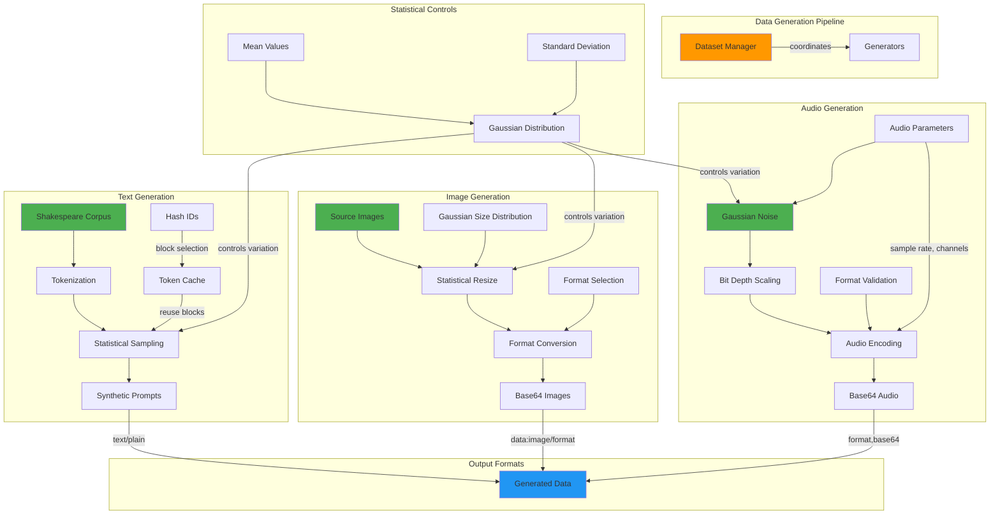

<!--
#  SPDX-FileCopyrightText: Copyright (c) 2025 NVIDIA CORPORATION & AFFILIATES. All rights reserved.
#  SPDX-License-Identifier: Apache-2.0
-->
# Synthetic Data Generation

**Summary:** AIPerf provides comprehensive synthetic data generation capabilities for creating realistic test datasets including text prompts, images, and audio files, enabling reproducible benchmarking without requiring external data sources.

## Overview

AIPerf's synthetic data generation system enables the creation of realistic test data for benchmarking AI models without relying on external datasets. The system supports multiple data modalities including text prompts (from corpus tokenization), images (resized from source assets), and audio (generated waveforms). Each generator uses statistical distributions and configurable parameters to create diverse, reproducible datasets that can simulate real-world workloads while maintaining control over data characteristics.

## Key Concepts

- **Multi-Modal Generation**: Support for text, image, and audio data generation
- **Statistical Sampling**: Gaussian distributions for realistic data variation
- **Corpus-Based Text Generation**: Token-level prompt generation from literary corpus
- **Image Transformation**: Source image resizing and format conversion
- **Audio Synthesis**: Gaussian noise generation with configurable parameters
- **Reproducible Generation**: Deterministic output with seed control
- **Format Support**: Multiple output formats (PNG/JPEG for images, WAV/MP3 for audio)

## Practical Example

```python
# Text Prompt Generation from Shakespeare corpus
from aiperf.services.dataset.generator.prompt import PromptGenerator
from aiperf.common.tokenizer import Tokenizer

# Initialize tokenizer and generate prompts
tokenizer = Tokenizer.from_pretrained("gpt2")

# Generate prompt with statistical length variation
synthetic_prompt = PromptGenerator.create_synthetic_prompt(
    tokenizer=tokenizer,
    prompt_tokens_mean=550,      # Target token count
    prompt_tokens_stddev=250,    # Variation around mean
)

# Generate prompt with token reuse for caching scenarios
cached_prompt = PromptGenerator.create_synthetic_prompt(
    tokenizer=tokenizer,
    prompt_tokens_mean=1024,
    hash_ids=[1, 2, 3, 4],      # Hash IDs for token block reuse
    block_size=256,              # Tokens per block
)

# Image Generation with size variation
from aiperf.services.dataset.generator.image import ImageGenerator
from aiperf.common.enums import ImageFormat

# Generate image with statistical size distribution
base64_image = ImageGenerator.create_synthetic_image(
    image_width_mean=512,
    image_width_stddev=128,
    image_height_mean=512,
    image_height_stddev=128,
    image_format=ImageFormat.JPEG
)

# Random format selection for format diversity
random_format_image = ImageGenerator.create_synthetic_image(
    image_width_mean=256,
    image_width_stddev=64,
    image_height_mean=256,
    image_height_stddev=64,
    image_format=None  # Randomly selects PNG or JPEG
)

# Audio Generation with configurable parameters
from aiperf.services.dataset.generator.audio import AudioGenerator
from aiperf.common.enums import AudioFormat

# Audio configuration (would use ConfigAudio when implemented)
class AudioConfig:
    def __init__(self):
        self.length = type('Length', (), {'mean': 2.0, 'stddev': 0.5})()
        self.sample_rates = [44.1, 48.0]  # kHz options
        self.depths = [16, 24]            # Bit depth options
        self.format = AudioFormat.WAV
        self.num_channels = 2             # Stereo

config = AudioConfig()

# Generate synthetic audio with Gaussian noise
audio_data_uri = AudioGenerator.create_synthetic_audio(config)

# Dataset Manager Integration
from aiperf.services.dataset.dataset_manager import DatasetManager
from aiperf.common.config.service_config import ServiceConfig

# Initialize dataset manager for coordinated generation
dataset_manager = DatasetManager(
    service_config=ServiceConfig(),
    service_id="dataset_gen_001"
)

# The dataset manager coordinates generation across modalities
# and manages data distribution to workers
```

## Visual Diagram



## Best Practices and Pitfalls

**Best Practices:**
- Use statistical distributions (Gaussian) for realistic data variation
- Implement rejection sampling to maintain proper distribution shapes
- Validate parameters before generation (sample rates, bit depths, formats)
- Use deterministic seeds for reproducible test datasets
- Implement proper error handling for unsupported format combinations
- Cache tokenized corpus for efficient prompt generation
- Use base64 encoding for binary data transport over ZMQ
- Implement proper resource cleanup for large generated datasets

**Common Pitfalls:**
- Not validating format-specific constraints (e.g., MP3 sample rate limitations)
- Using blocking operations in generation loops
- Insufficient error handling for malformed source assets
- Memory leaks when generating large datasets
- Not handling edge cases in statistical sampling (negative values)
- Hardcoding paths to source assets instead of using relative paths
- Missing validation for audio channel configurations
- Not implementing proper timeout handling for large file generation

## Discussion Points

- How can we balance synthetic data realism with generation performance?
- What strategies can be used to validate that synthetic data represents real-world distributions?
- How can we extend the generation system to support additional modalities like video or structured data?
