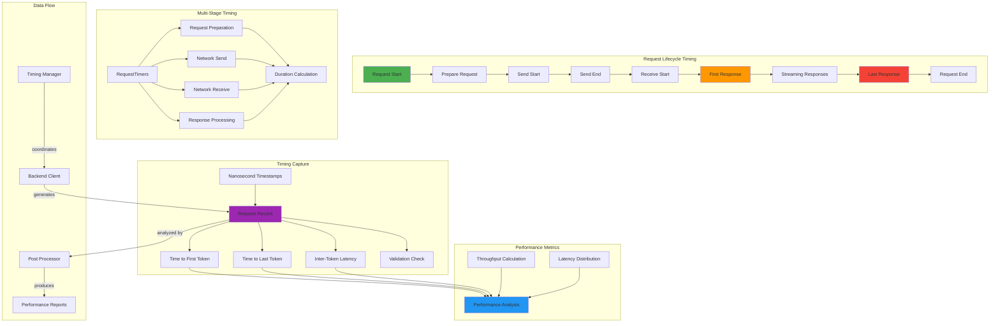

<!--
#  SPDX-FileCopyrightText: Copyright (c) 2025 NVIDIA CORPORATION & AFFILIATES. All rights reserved.
#  SPDX-License-Identifier: Apache-2.0
#
#  Licensed under the Apache License, Version 2.0 (the "License");
#  you may not use this file except in compliance with the License.
#  You may obtain a copy of the License at
#
#  http://www.apache.org/licenses/LICENSE-2.0
#
#  Unless required by applicable law or agreed to in writing, software
#  distributed under the License is distributed on an "AS IS" BASIS,
#  WITHOUT WARRANTIES OR CONDITIONS OF ANY KIND, either express or implied.
#  See the License for the specific language governing permissions and
#  limitations under the License.
-->
# Performance Measurement and Timing

**Summary:** AIPerf implements a comprehensive performance measurement system using nanosecond-precision timing, request records, and multi-stage timing capture to provide detailed insights into AI model performance characteristics.

## Overview

AIPerf's performance measurement system is designed to capture detailed timing information throughout the entire request lifecycle, from initial request creation to final response processing. The system uses nanosecond-precision timestamps, structured request records, and multi-stage timing capture to provide comprehensive performance metrics. This enables accurate measurement of latency, throughput, and other performance characteristics essential for AI model benchmarking.

## Key Concepts

- **Nanosecond Precision**: High-resolution timing using `time.time_ns()` for accurate measurements
- **Request Records**: Structured data models capturing complete request lifecycle
- **Multi-Stage Timing**: Separate timing for different request processing stages
- **Streaming Response Handling**: Timestamp capture for each response chunk in streaming scenarios
- **Time-to-First-Token (TTFT)**: Critical metric for interactive AI applications
- **Time-to-Last-Token (TTLT)**: Total response time measurement
- **Request Validation**: Automatic validation of timing data integrity

## Practical Example

```python
# Request Record with comprehensive timing
from aiperf.common.models import RequestRecord, RequestTimers, RequestTimerKind
import time

# Create request record for performance tracking
record = RequestRecord()
print(f"Request started at: {record.start_time_}")

# Simulate streaming response with timing capture
async def process_streaming_request(client, payload):
    """Process request with detailed timing measurement."""
    record = RequestRecord()

    # Send request and capture streaming responses
    async for response_chunk in client.stream_request(payload):
        # Capture timestamp for each response chunk
        timestamp = time.time_ns()
        record.response_timestamps_ns.append(timestamp)
        record.responses.append(response_chunk)

        # Check for end of sequence
        if response_chunk.finish_reason == "stop":
            record.sequence_end = True
            break

    return record

# Analyze performance metrics
def analyze_performance(record: RequestRecord):
    """Extract key performance metrics from request record."""
    if not record.valid:
        print("Invalid request record - cannot calculate metrics")
        return

    # Time to first response (TTFT)
    ttft_ms = record.time_to_first_response_ns / 1e6
    print(f"Time to First Token: {ttft_ms:.2f} ms")

    # Time to last response (TTLT)
    ttlt_ms = record.time_to_last_response_ns / 1e6
    print(f"Time to Last Token: {ttlt_ms:.2f} ms")

    # Response count and timing
    response_count = len(record.responses)
    print(f"Total Responses: {response_count}")

    # Calculate inter-token latency
    if len(record.response_timestamps_ns) > 1:
        inter_token_latencies = []
        for i in range(1, len(record.response_timestamps_ns)):
            latency = (record.response_timestamps_ns[i] -
                      record.response_timestamps_ns[i-1]) / 1e6
            inter_token_latencies.append(latency)

        avg_inter_token = sum(inter_token_latencies) / len(inter_token_latencies)
        print(f"Average Inter-Token Latency: {avg_inter_token:.2f} ms")

# Advanced timing with RequestTimers
def detailed_request_timing():
    """Demonstrate detailed request timing stages."""
    timers = RequestTimers()

    # Capture different stages of request processing
    timers.capture_timestamp(RequestTimerKind.REQUEST_START)

    # Simulate request preparation
    await prepare_request()
    timers.capture_timestamp(RequestTimerKind.SEND_START)

    # Simulate sending request
    await send_request_data()
    timers.capture_timestamp(RequestTimerKind.SEND_END)

    # Simulate waiting for response
    timers.capture_timestamp(RequestTimerKind.RECV_START)
    await receive_response()
    timers.capture_timestamp(RequestTimerKind.RECV_END)

    timers.capture_timestamp(RequestTimerKind.REQUEST_END)

    # Calculate stage durations
    send_duration = timers.duration(
        RequestTimerKind.SEND_START,
        RequestTimerKind.SEND_END
    ) / 1e6  # Convert to milliseconds

    recv_duration = timers.duration(
        RequestTimerKind.RECV_START,
        RequestTimerKind.RECV_END
    ) / 1e6

    total_duration = timers.duration(
        RequestTimerKind.REQUEST_START,
        RequestTimerKind.REQUEST_END
    ) / 1e6

    print(f"Send Duration: {send_duration:.2f} ms")
    print(f"Receive Duration: {recv_duration:.2f} ms")
    print(f"Total Duration: {total_duration:.2f} ms")

# Integration with OpenAI backend client
async def benchmark_openai_performance():
    """Benchmark OpenAI API performance with detailed metrics."""
    from aiperf.backend.openai_client import OpenAIBackendClient

    # Create client and send request
    record = await client.send_request(
        endpoint="v1/chat/completions",
        payload=formatted_payload
    )

    # Analyze performance
    if record.valid:
        print(f"✅ Request completed successfully")
        print(f"TTFT: {record.time_to_first_response_ns / 1e6:.2f} ms")
        print(f"TTLT: {record.time_to_last_response_ns / 1e6:.2f} ms")
        print(f"Response chunks: {len(record.responses)}")
    else:
        print("❌ Invalid request record")
```

## Visual Diagram



## Best Practices and Pitfalls

**Best Practices:**
- Use `time.time_ns()` for nanosecond precision timing measurements
- Always validate request records before calculating metrics using `record.valid`
- Capture timestamps immediately when events occur to minimize measurement overhead
- Use structured `RequestRecord` objects for consistent data collection
- Implement proper error handling for invalid timing data
- Store timestamps in nanoseconds and convert to appropriate units for display
- Use `RequestTimers` for detailed multi-stage timing analysis
- Implement timeout handling to prevent infinite waits

**Common Pitfalls:**
- Using lower precision timing functions like `time.time()`
- Not validating timing data before performing calculations
- Forgetting to handle edge cases where responses may be empty
- Blocking operations during timing measurement affecting accuracy
- Not accounting for clock skew in distributed timing scenarios
- Missing error handling for malformed response data
- Calculating metrics on incomplete request records
- Not resetting `RequestTimers` between measurements

## Discussion Points

- How can we ensure timing accuracy across different deployment environments?
- What are the trade-offs between measurement precision and system overhead?
- How can we implement distributed timing coordination for multi-node benchmarks?
