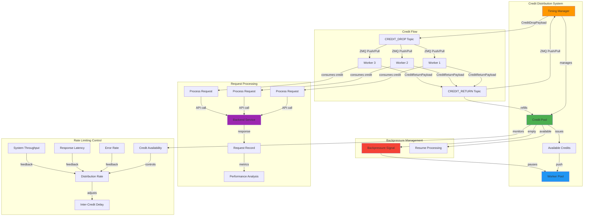

<!--
#  SPDX-FileCopyrightText: Copyright (c) 2025 NVIDIA CORPORATION & AFFILIATES. All rights reserved.
#  SPDX-License-Identifier: Apache-2.0
#
#  Licensed under the Apache License, Version 2.0 (the "License");
#  you may not use this file except in compliance with the License.
#  You may obtain a copy of the License at
#
#  http://www.apache.org/licenses/LICENSE-2.0
#
#  Unless required by applicable law or agreed to in writing, software
#  distributed under the License is distributed on an "AS IS" BASIS,
#  WITHOUT WARRANTIES OR CONDITIONS OF ANY KIND, either express or implied.
#  See the License for the specific language governing permissions and
#  limitations under the License.
-->
# Credit System and Rate Limiting

**Summary:** AIPerf implements a sophisticated credit-based rate limiting system that controls request flow through the distributed system, ensuring optimal resource utilization and preventing system overload through coordinated credit distribution and return mechanisms.

## Overview

The credit system in AIPerf serves as a distributed rate limiting and flow control mechanism that regulates how requests are processed across the system. The Timing Manager acts as the central credit authority, issuing credits to workers through a push/pull pattern, while workers consume credits to process requests and return them upon completion. This approach enables fine-grained control over system load, prevents resource exhaustion, and ensures predictable performance characteristics during benchmarking.

## Key Concepts

- **Credit-Based Flow Control**: Tokens that authorize request processing
- **Centralized Credit Management**: Timing Manager as the credit authority
- **Push/Pull Distribution**: ZMQ patterns for credit distribution and return
- **Asynchronous Credit Handling**: Non-blocking credit operations
- **Load Balancing**: Automatic work distribution based on credit availability
- **Backpressure Management**: System-wide flow control through credit scarcity
- **Credit Pool Management**: Dynamic credit allocation and recycling

## Practical Example

```python
# Timing Manager - Credit Distribution Authority
from aiperf.services.timing_manager.timing_manager import TimingManager
from aiperf.common.models import CreditDropPayload, CreditReturnPayload
import asyncio
import time

class TimingManager(BaseComponentService):
    """Central authority for credit distribution and rate limiting."""

    def __init__(self, service_config: ServiceConfig, service_id: str | None = None):
        super().__init__(service_config=service_config, service_id=service_id)
        self._credit_lock = asyncio.Lock()
        self._credits_available = 5000  # Initial credit pool
        self._credit_drop_task: asyncio.Task | None = None

    async def _issue_credit_drops(self) -> None:
        """Continuously issue credits to workers based on availability."""
        while not self.stop_event.is_set():
            try:
                async with self._credit_lock:
                    if self._credits_available <= 0:
                        self.logger.warning("No credits available, pausing distribution")
                        await asyncio.sleep(0.1)
                        continue

                    # Issue credit to worker pool
                    self._credits_available -= 1

                # Send credit drop message
                await self.comms.push(
                    topic=Topic.CREDIT_DROP,
                    message=self.create_message(
                        payload=CreditDropPayload(
                            amount=1,
                            timestamp=time.time_ns(),
                        ),
                    ),
                )

                # Control credit distribution rate
                await asyncio.sleep(0.001)  # 1ms between credits = 1000 RPS max

            except asyncio.CancelledError:
                break
            except Exception as e:
                self.logger.error(f"Error issuing credit: {e}")
                await asyncio.sleep(0.1)

    async def _on_credit_return(self, message: Message) -> None:
        """Process credit return from workers."""
        async with self._credit_lock:
            returned_amount = message.payload.amount
            self._credits_available += returned_amount
            self.logger.debug(f"Returned {returned_amount} credits, "
                            f"pool now has {self._credits_available}")

# Worker - Credit Consumer
from aiperf.services.worker.worker import Worker

class Worker(BaseService):
    """Worker that consumes credits to process requests."""

    async def _process_credit_drop(self, message) -> None:
        """Process received credit and perform work."""
        try:
            if hasattr(message, "payload") and hasattr(message.payload, "amount"):
                credit_amount = message.payload.amount
                self.logger.info(f"Received {credit_amount} credit(s)")

                # Process requests based on credits received
                for _ in range(credit_amount):
                    await self._process_single_request()

                    # Small delay between requests to prevent overwhelming
                    await asyncio.sleep(0.01)

            else:
                self.logger.warning("Invalid credit drop message")

        except Exception as e:
            self.logger.error(f"Error processing credit: {e}")
        finally:
            # Always return credits to maintain flow
            await self._return_credits(credit_amount)

    async def _process_single_request(self) -> None:
        """Process a single request using the consumed credit."""
        try:
            # Simulate API call or processing work
            if self.openai_client:
                messages = [
                    {"role": "system", "content": "You are a helpful assistant."},
                    {"role": "user", "content": "Generate a response for benchmarking."}
                ]

                formatted_payload = await self.openai_client.format_payload(
                    endpoint="v1/chat/completions",
                    payload={"messages": messages}
                )

                record = await self.openai_client.send_request(
                    endpoint="v1/chat/completions",
                    payload=formatted_payload
                )

                if record.valid:
                    self.logger.debug(f"Request completed: "
                                    f"TTFT={record.time_to_first_response_ns / 1e6:.2f}ms")

        except Exception as e:
            self.logger.error(f"Request processing failed: {e}")

    async def _return_credits(self, amount: int) -> None:
        """Return credits to the timing manager."""
        await self.comms.push(
            topic=Topic.CREDIT_RETURN,
            message=self.create_message(
                payload=CreditReturnPayload(amount=amount),
            ),
        )
        self.logger.debug(f"Returned {amount} credits to pool")

# Advanced Credit Management
class AdaptiveCreditManager:
    """Advanced credit manager with adaptive rate control."""

    def __init__(self, initial_credits: int = 1000):
        self.total_credits = initial_credits
        self.available_credits = initial_credits
        self.credit_lock = asyncio.Lock()
        self.metrics = {
            "credits_issued": 0,
            "credits_returned": 0,
            "average_processing_time": 0.0,
            "error_rate": 0.0
        }

    async def adaptive_credit_distribution(self) -> None:
        """Adjust credit distribution based on system performance."""
        while True:
            async with self.credit_lock:
                # Calculate system health metrics
                error_rate = self.metrics["error_rate"]
                avg_processing_time = self.metrics["average_processing_time"]

                # Adjust credit distribution rate based on performance
                if error_rate > 0.1:  # High error rate
                    distribution_delay = 0.1  # Slow down
                elif avg_processing_time > 1000:  # Slow responses (>1s)
                    distribution_delay = 0.05  # Moderate slowdown
                else:
                    distribution_delay = 0.001  # Normal rate

                self.logger.debug(f"Adaptive delay: {distribution_delay}s "
                                f"(error_rate={error_rate:.2%}, "
                                f"avg_time={avg_processing_time:.2f}ms)")

            await asyncio.sleep(distribution_delay)

    async def monitor_credit_pool(self) -> None:
        """Monitor and log credit pool status."""
        while True:
            async with self.credit_lock:
                utilization = (self.total_credits - self.available_credits) / self.total_credits
                self.logger.info(f"Credit pool utilization: {utilization:.1%} "
                               f"({self.available_credits}/{self.total_credits} available)")

            await asyncio.sleep(5.0)  # Report every 5 seconds
```

## Visual Diagram



## Best Practices and Pitfalls

**Best Practices:**
- Use async locks (`asyncio.Lock`) for thread-safe credit pool management
- Implement proper error handling in credit processing to prevent credit leaks
- Always return credits in finally blocks to ensure credit conservation
- Monitor credit pool utilization and adjust distribution rates accordingly
- Use ZMQ push/pull patterns for efficient credit distribution
- Implement adaptive rate limiting based on system performance metrics
- Log credit operations for debugging and system monitoring
- Set reasonable initial credit pool sizes based on expected load

**Common Pitfalls:**
- Not returning credits on error conditions, leading to credit pool depletion
- Race conditions in credit pool access without proper locking
- Blocking operations in credit processing affecting system responsiveness
- Not handling worker failures that could result in lost credits
- Insufficient monitoring of credit pool status leading to unexpected bottlenecks
- Setting credit distribution rates too high, overwhelming downstream services
- Not implementing backpressure handling when credit pool is exhausted
- Missing timeout handling in credit operations

## Discussion Points

- How can we implement credit-based rate limiting across multiple AIPerf instances?
- What strategies can be used to handle credit conservation during system failures?
- How can we balance fine-grained rate control with system performance overhead?
