<!--
#  SPDX-FileCopyrightText: Copyright (c) 2025 NVIDIA CORPORATION & AFFILIATES. All rights reserved.
#  SPDX-License-Identifier: Apache-2.0
#
#  Licensed under the Apache License, Version 2.0 (the "License");
#  you may not use this file except in compliance with the License.
#  You may obtain a copy of the License at
#
#  http://www.apache.org/licenses/LICENSE-2.0
#
#  Unless required by applicable law or agreed to in writing, software
#  distributed under the License is distributed on an "AS IS" BASIS,
#  WITHOUT WARRANTIES OR CONDITIONS OF ANY KIND, either express or implied.
#  See the License for the specific language governing permissions and
#  limitations under the License.
-->
# Containerization and Deployment

**Summary:** AIPerf provides comprehensive containerization support with Docker for local development and production deployment, Kubernetes integration for distributed scaling, and VS Code dev containers for consistent development environments.

## Overview

AIPerf's containerization strategy supports multiple deployment scenarios from local development to large-scale distributed deployments. The system includes multi-stage Docker builds for optimized production images, Kubernetes service managers for orchestrated deployments, and development containers for consistent developer experiences. The architecture supports both single-node multiprocessing and multi-node Kubernetes deployments, enabling flexible scaling based on workload requirements.

## Key Concepts

- **Multi-Stage Docker Builds**: Optimized images for development and production
- **Development Containers**: VS Code integration with consistent tooling
- **Kubernetes Orchestration**: Distributed service deployment and management
- **Service Run Types**: Configurable deployment modes (multiprocessing vs Kubernetes)
- **Container Networking**: Host networking for optimal ZMQ performance
- **GPU Support**: NVIDIA GPU access in containerized environments
- **Volume Management**: Persistent storage for development and data

## Practical Example

```dockerfile
# Multi-stage Dockerfile for AIPerf
FROM python:3.12-slim AS base

ENV USERNAME=appuser
ENV APP_NAME=aiperf

# Create app user for security
RUN groupadd -r $USERNAME \
    && useradd -r -g $USERNAME $USERNAME

# Install uv for fast Python package management
COPY --from=ghcr.io/astral-sh/uv:latest /uv /uvx /bin/

#######################################
########## Local Development ##########
#######################################

FROM base AS local-dev

# Development-specific configuration
ARG USER_UID=1000
ARG USER_GID=1000

# Install development tools and configure sudo access
RUN apt-get update -y \
    && apt-get install -y sudo gnupg2 gnupg1 tmux vim git curl procps make \
    && echo "$USERNAME ALL=(root) NOPASSWD:ALL" > /etc/sudoers.d/$USERNAME \
    && chmod 0440 /etc/sudoers.d/$USERNAME \
    && mkdir -p /home/$USERNAME \
    && chown -R $USERNAME:$USERNAME /home/$USERNAME

USER $USERNAME
ENV HOME=/home/$USERNAME
WORKDIR $HOME

# Configure persistent bash history
RUN SNIPPET="export PROMPT_COMMAND='history -a' && export HISTFILE=$HOME/.commandhistory/.bash_history" \
    && mkdir -p $HOME/.commandhistory \
    && touch $HOME/.commandhistory/.bash_history \
    && echo "$SNIPPET" >> "$HOME/.bashrc"

ENTRYPOINT ["/bin/bash"]

############################################
############# Production Build #############
############################################

FROM base AS final

# Create virtual environment
RUN mkdir /opt/$APP_NAME \
    && uv venv /opt/$APP_NAME/venv --python 3.12 \
    && chown -R $USERNAME:$USERNAME /opt/$APP_NAME

# Activate virtual environment
ENV VIRTUAL_ENV=/opt/$APP_NAME/venv
ENV PATH="${VIRTUAL_ENV}/bin:${PATH}"

# Copy and install dependencies
COPY pyproject.toml .
RUN uv sync --active --no-install-project

# Copy application code and install
COPY . .
RUN uv sync --active --no-dev

# Set user and entrypoint
USER $USERNAME
ENTRYPOINT ["aiperf"]
```

```yaml
# Development Container Configuration (.devcontainer/devcontainer.json)
{
    "name": "NVIDIA AIPerf Development",
    "remoteUser": "appuser",
    "updateRemoteUserUID": true,
    "build": {
        "dockerfile": "../Dockerfile",
        "context": ".",
        "target": "local-dev"
    },
    "runArgs": [
        "--gpus=all",           # GPU access for AI workloads
        "--network=host",       # Host networking for ZMQ performance
        "--ipc=host",          # Shared memory access
        "--cap-add=SYS_PTRACE", # Debugging capabilities
        "--shm-size=10G",      # Large shared memory for AI models
        "--ulimit=memlock=-1", # Unlimited memory locking
        "--ulimit=stack=67108864",
        "--ulimit=nofile=65536:65536"
    ],
    "customizations": {
        "vscode": {
            "extensions": [
                "ms-python.python",
                "ms-python.pylint",
                "ms-python.vscode-pylance",
                "charliermarsh.ruff"
            ],
            "settings": {
                "python.defaultInterpreterPath": "/opt/aiperf/venv/bin/python",
                "python.linting.ruffEnabled": true,
                "editor.formatOnSave": true,
                "editor.codeActionsOnSave": {
                    "source.organizeImports": true
                }
            }
        }
    },
    "containerEnv": {
        "GITHUB_TOKEN": "${localEnv:GITHUB_TOKEN}",
        "HF_TOKEN": "${localEnv:HF_TOKEN}"
    },
    "mounts": [
        "source=appuser-aiperf-bashhistory,target=/home/appuser/.commandhistory,type=volume",
        "source=appuser-aiperf-precommit-cache,target=/home/appuser/.cache/pre-commit,type=volume",
        "source=appuser-aiperf-venv,target=/home/appuser/.venv,type=volume"
    ]
}
```

```python
# Kubernetes Service Manager Integration
from aiperf.services.service_manager.kubernetes import KubernetesServiceManager
from aiperf.common.enums import ServiceRunType

class SystemController(BaseControllerService):
    """System controller with deployment mode selection."""

    async def _initialize(self) -> None:
        """Initialize service manager based on deployment mode."""
        if self.service_config.service_run_type == ServiceRunType.MULTIPROCESSING:
            # Single-node deployment with multiprocessing
            self.service_manager = MultiProcessServiceManager(
                self.required_service_types,
                self.service_config
            )
        elif self.service_config.service_run_type == ServiceRunType.KUBERNETES:
            # Multi-node deployment with Kubernetes
            self.service_manager = KubernetesServiceManager(
                self.required_service_types,
                self.service_config
            )
        else:
            raise ConfigError(f"Unsupported run type: {self.service_config.service_run_type}")

# CLI Configuration for Deployment Mode
def main() -> None:
    """Main entry point with deployment configuration."""
    parser = ArgumentParser(description="AIPerf Benchmarking System")
    parser.add_argument(
        "--run-type",
        type=str,
        default="process",
        choices=["process", "k8s"],
        help="Deployment backend: 'process' for multiprocessing, 'k8s' for Kubernetes"
    )

    args = parser.parse_args()

    # Create service configuration
    config = ServiceConfig(
        service_run_type=ServiceRunType.MULTIPROCESSING if args.run_type == "process"
                        else ServiceRunType.KUBERNETES
    )

    # Start system with selected deployment mode
    bootstrap_and_run_service(SystemController, service_config=config)

# Docker Compose for Local Development
version: '3.8'
services:
  aiperf:
    build:
      context: .
      dockerfile: Dockerfile
      target: local-dev
    volumes:
      - .:/workspace
      - aiperf-venv:/home/appuser/.venv
    environment:
      - OPENAI_API_KEY=${OPENAI_API_KEY}
    network_mode: host
    deploy:
      resources:
        reservations:
          devices:
            - driver: nvidia
              count: all
              capabilities: [gpu]

volumes:
  aiperf-venv:
```

## Visual Diagram

```mermaid
graph TB
    subgraph "Development Environment"
        DEV_CONTAINER[VS Code Dev Container] --> |mounts| WORKSPACE[Workspace Volume]
        DEV_CONTAINER --> |uses| DEV_IMAGE[Development Image]
        DEV_IMAGE --> |includes| DEV_TOOLS[Development Tools]
        DEV_TOOLS --> |tmux, vim, git| TOOLING[Developer Tooling]
    end

    subgraph "Container Images"
        DOCKERFILE[Multi-stage Dockerfile] --> DEV_IMAGE
        DOCKERFILE --> PROD_IMAGE[Production Image]
        BASE_IMAGE[Python 3.12 Base] --> DEV_IMAGE
        BASE_IMAGE --> PROD_IMAGE
    end

    subgraph "Local Deployment"
        DOCKER_COMPOSE[Docker Compose] --> |orchestrates| LOCAL_SERVICES[Local Services]
        LOCAL_SERVICES --> |multiprocessing| WORKERS[Worker Processes]
        LOCAL_SERVICES --> |host network| ZMQ_COMMS[ZMQ Communication]
    end

    subgraph "Kubernetes Deployment"
        K8S_MANAGER[Kubernetes Service Manager] --> |creates| PODS[Service Pods]
        PODS --> DATASET_POD[Dataset Manager Pod]
        PODS --> WORKER_POD[Worker Manager Pod]
        PODS --> TIMING_POD[Timing Manager Pod]
        PODS --> RECORDS_POD[Records Manager Pod]

        K8S_SERVICE[Kubernetes Services] --> |networking| PODS
        K8S_INGRESS[Ingress Controller] --> K8S_SERVICE
    end

    subgraph "Configuration Management"
        CLI[Command Line Interface] --> |--run-type| CONFIG[Service Config]
        CONFIG --> |process| MULTIPROCESS[Multiprocessing Mode]
        CONFIG --> |k8s| KUBERNETES[Kubernetes Mode]

        ENV_VARS[Environment Variables] --> CONFIG
        CONFIG_FILES[Configuration Files] --> CONFIG
    end

    subgraph "Resource Management"
        GPU_ACCESS[GPU Access] --> |--gpus=all| CONTAINERS[Container Runtime]
        SHARED_MEMORY[Shared Memory] --> |--shm-size| CONTAINERS
        HOST_NETWORK[Host Networking] --> |--network=host| CONTAINERS
        VOLUMES[Persistent Volumes] --> |data persistence| CONTAINERS
    end

    style DEV_CONTAINER fill:#4caf50
    style PROD_IMAGE fill:#2196f3
    style K8S_MANAGER fill:#ff9800
    style CLI fill:#9c27b0
    style GPU_ACCESS fill:#f44336
```



## Best Practices and Pitfalls

**Best Practices:**
- Use multi-stage Docker builds to optimize image sizes for different environments
- Implement proper user management in containers (non-root execution)
- Configure host networking for optimal ZMQ performance in containerized environments
- Use volume mounts for persistent development data and caching
- Set appropriate resource limits and requests for Kubernetes deployments
- Implement health checks for container orchestration
- Use environment variables for configuration management across environments
- Configure proper GPU access for AI workloads in containers

**Common Pitfalls:**
- Running containers as root user, creating security vulnerabilities
- Not configuring proper networking for ZMQ communication in containers
- Missing GPU device access configuration for AI workloads
- Insufficient shared memory allocation for large model processing
- Not implementing proper volume management for persistent data
- Hardcoding configuration values instead of using environment variables
- Missing resource limits leading to container resource exhaustion
- Not handling container lifecycle events properly in Kubernetes

## Discussion Points

- How can we optimize container startup times for faster development iteration?
- What are the trade-offs between host networking and container networking for ZMQ performance?
- How can we implement blue-green deployments for AIPerf in Kubernetes environments?
