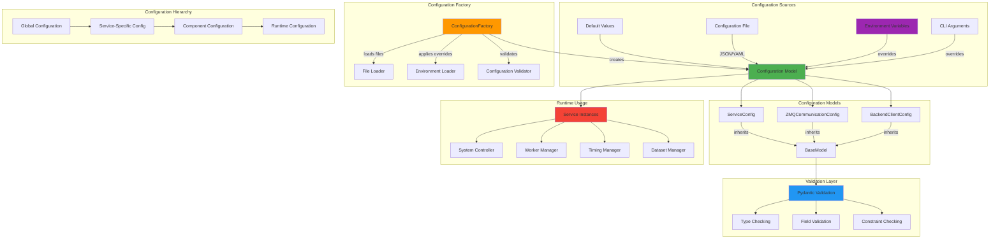

<!--
#  SPDX-FileCopyrightText: Copyright (c) 2025 NVIDIA CORPORATION & AFFILIATES. All rights reserved.
#  SPDX-License-Identifier: Apache-2.0
#
#  Licensed under the Apache License, Version 2.0 (the "License");
#  you may not use this file except in compliance with the License.
#  You may obtain a copy of the License at
#
#  http://www.apache.org/licenses/LICENSE-2.0
#
#  Unless required by applicable law or agreed to in writing, software
#  distributed under the License is distributed on an "AS IS" BASIS,
#  WITHOUT WARRANTIES OR CONDITIONS OF ANY KIND, either express or implied.
#  See the License for the specific language governing permissions and
#  limitations under the License.
-->
# Configuration Management System

**Summary:** AIPerf implements a robust configuration management system using Pydantic models for type-safe configuration, environment variable handling, and service configuration patterns that support both development and production environments.

## Overview

AIPerf's configuration management system provides a comprehensive approach to handling application settings across different environments and deployment scenarios. The system uses Pydantic models for type-safe configuration validation, supports environment variable overrides, and implements hierarchical configuration patterns. This enables consistent configuration management from local development through production deployments while maintaining flexibility and validation.

## Key Concepts

- **Pydantic Configuration Models**: Type-safe configuration with automatic validation
- **Environment Variable Integration**: Seamless override capabilities for deployment flexibility
- **Hierarchical Configuration**: Layered configuration with inheritance and composition
- **Service-Specific Configuration**: Specialized configuration models for different services
- **Runtime Configuration**: Dynamic configuration updates and validation
- **Default Value Management**: Sensible defaults with override capabilities
- **Configuration Validation**: Automatic validation and error reporting

## Practical Example

```python
# Base Service Configuration with Pydantic
from pydantic import BaseModel, Field
from aiperf.common.enums import CommunicationBackend, ServiceRunType

class ServiceConfig(BaseModel):
    """Base configuration for all AIPerf services."""

    # Deployment configuration
    service_run_type: ServiceRunType = Field(
        default=ServiceRunType.MULTIPROCESSING,
        description="Deployment mode: MULTIPROCESSING or KUBERNETES"
    )

    # Communication configuration
    comm_backend: CommunicationBackend = Field(
        default=CommunicationBackend.ZMQ_TCP,
        description="Communication backend to use"
    )

    # Timing and coordination
    heartbeat_timeout: float = Field(
        default=60.0,
        description="Service heartbeat timeout in seconds"
    )
    registration_timeout: float = Field(
        default=60.0,
        description="Service registration timeout in seconds"
    )
    command_timeout: float = Field(
        default=10.0,
        description="Command response timeout in seconds"
    )
    heartbeat_interval: float = Field(
        default=10.0,
        description="Heartbeat interval in seconds"
    )

    # Worker management
    min_workers: int = Field(
        default=5,
        description="Minimum number of workers to maintain"
    )
    max_workers: int = Field(
        default=100,
        description="Maximum number of workers"
    )
    target_idle_workers: int = Field(
        default=10,
        description="Target number of idle workers"
    )

# ZMQ Communication Configuration
class ZMQTCPTransportConfig(BaseModel):
    """TCP transport configuration for ZMQ communication."""

    host: str = Field(
        default="0.0.0.0",
        description="Host address for TCP connections"
    )
    controller_pub_sub_port: int = Field(
        default=5555,
        description="Port for controller pub/sub messages"
    )
    component_pub_sub_port: int = Field(
        default=5556,
        description="Port for component pub/sub messages"
    )
    inference_push_pull_port: int = Field(
        default=5557,
        description="Port for inference push/pull messages"
    )
    credit_drop_port: int = Field(
        default=5562,
        description="Port for credit drop operations"
    )
    credit_return_port: int = Field(
        default=5563,
        description="Port for credit return operations"
    )

class ZMQCommunicationConfig(BaseModel):
    """Complete ZMQ communication configuration."""

    protocol_config: ZMQTCPTransportConfig = Field(
        default_factory=ZMQTCPTransportConfig,
        description="TCP protocol configuration"
    )
    client_id: str | None = Field(
        default=None,
        description="Client ID (auto-generated if not provided)"
    )

    @property
    def controller_pub_sub_address(self) -> str:
        """Generate controller pub/sub address."""
        return f"tcp://{self.protocol_config.host}:{self.protocol_config.controller_pub_sub_port}"

    @property
    def credit_drop_address(self) -> str:
        """Generate credit drop address."""
        return f"tcp://{self.protocol_config.host}:{self.protocol_config.credit_drop_port}"

# Backend Client Configuration
class BaseBackendClientConfig(BaseModel):
    """Base configuration for all backend clients."""

    url: str = Field(
        default="localhost:8000",
        description="Backend service URL"
    )
    protocol: str = Field(
        default="http",
        description="Communication protocol"
    )
    timeout_ms: int = Field(
        default=5000,
        description="Request timeout in milliseconds"
    )
    headers: dict[str, str] = Field(
        default_factory=dict,
        description="HTTP headers for requests"
    )
    api_key: str | None = Field(
        default=None,
        description="API key for authentication"
    )

class OpenAIBackendClientConfig(BaseBackendClientConfig):
    """OpenAI-specific backend configuration."""

    model: str = Field(
        default="gpt-3.5-turbo",
        description="OpenAI model to use"
    )
    max_tokens: int = Field(
        default=100,
        description="Maximum tokens in response"
    )
    temperature: float = Field(
        default=0.7,
        description="Response randomness (0.0-2.0)"
    )
    top_p: float = Field(
        default=1.0,
        description="Nucleus sampling parameter"
    )
    frequency_penalty: float = Field(
        default=0.0,
        description="Frequency penalty (-2.0 to 2.0)"
    )
    presence_penalty: float = Field(
        default=0.0,
        description="Presence penalty (-2.0 to 2.0)"
    )

# Environment Variable Integration
import os
from typing import Any

class EnvironmentConfigLoader:
    """Load configuration from environment variables."""

    @staticmethod
    def load_service_config() -> ServiceConfig:
        """Load service configuration with environment overrides."""
        config_dict = {
            "service_run_type": os.getenv("AIPERF_RUN_TYPE", "process"),
            "comm_backend": os.getenv("AIPERF_COMM_BACKEND", "zmq_tcp"),
            "heartbeat_timeout": float(os.getenv("AIPERF_HEARTBEAT_TIMEOUT", "60.0")),
            "max_workers": int(os.getenv("AIPERF_MAX_WORKERS", "100")),
        }

        # Remove None values to use defaults
        config_dict = {k: v for k, v in config_dict.items() if v is not None}

        return ServiceConfig(**config_dict)

    @staticmethod
    def load_openai_config() -> OpenAIBackendClientConfig:
        """Load OpenAI configuration from environment."""
        return OpenAIBackendClientConfig(
            api_key=os.getenv("OPENAI_API_KEY"),
            url=os.getenv("OPENAI_BASE_URL", "https://api.openai.com/v1"),
            model=os.getenv("OPENAI_MODEL", "gpt-3.5-turbo"),
            max_tokens=int(os.getenv("OPENAI_MAX_TOKENS", "100")),
            temperature=float(os.getenv("OPENAI_TEMPERATURE", "0.7")),
        )

# Configuration Factory Pattern
class ConfigurationFactory:
    """Factory for creating configuration objects."""

    @staticmethod
    def create_service_config(
        config_file: str | None = None,
        env_overrides: bool = True
    ) -> ServiceConfig:
        """Create service configuration with optional file and environment overrides."""

        # Start with defaults
        config = ServiceConfig()

        # Load from file if provided
        if config_file:
            config = ConfigurationFactory._load_from_file(config_file)

        # Apply environment overrides
        if env_overrides:
            config = ConfigurationFactory._apply_env_overrides(config)

        return config

    @staticmethod
    def _load_from_file(config_file: str) -> ServiceConfig:
        """Load configuration from JSON/YAML file."""
        import json
        import yaml
        from pathlib import Path

        config_path = Path(config_file)

        if config_path.suffix == ".json":
            with open(config_path) as f:
                config_dict = json.load(f)
        elif config_path.suffix in [".yaml", ".yml"]:
            with open(config_path) as f:
                config_dict = yaml.safe_load(f)
        else:
            raise ValueError(f"Unsupported config file format: {config_path.suffix}")

        return ServiceConfig(**config_dict)

    @staticmethod
    def _apply_env_overrides(config: ServiceConfig) -> ServiceConfig:
        """Apply environment variable overrides to configuration."""
        env_config = EnvironmentConfigLoader.load_service_config()

        # Merge configurations (environment takes precedence)
        config_dict = config.model_dump()
        env_dict = env_config.model_dump()

        # Update with non-default environment values
        for key, value in env_dict.items():
            if value != ServiceConfig().model_dump()[key]:  # Not default value
                config_dict[key] = value

        return ServiceConfig(**config_dict)

# CLI Integration
from argparse import ArgumentParser

def main() -> None:
    """Main entry point with configuration management."""
    parser = ArgumentParser(description="AIPerf Benchmarking System")
    parser.add_argument(
        "--config",
        type=str,
        help="Path to configuration file (JSON/YAML)"
    )
    parser.add_argument(
        "--log-level",
        type=str,
        default="INFO",
        choices=["DEBUG", "INFO", "WARNING", "ERROR", "CRITICAL"],
        help="Logging level"
    )
    parser.add_argument(
        "--run-type",
        type=str,
        default="process",
        choices=["process", "k8s"],
        help="Deployment mode"
    )

    args = parser.parse_args()

    # Create configuration with file and environment support
    config = ConfigurationFactory.create_service_config(
        config_file=args.config,
        env_overrides=True
    )

    # Override with CLI arguments
    if args.run_type:
        config.service_run_type = ServiceRunType.KUBERNETES if args.run_type == "k8s" else ServiceRunType.MULTIPROCESSING

    # Validate final configuration
    try:
        config.model_validate(config.model_dump())
        logger.info("Configuration validated successfully")
    except Exception as e:
        logger.error(f"Configuration validation failed: {e}")
        sys.exit(1)

    # Start system with validated configuration
    bootstrap_and_run_service(SystemController, service_config=config)
```

## Visual Diagram



## Best Practices and Pitfalls

**Best Practices:**
- Use Pydantic models for all configuration to ensure type safety and validation
- Implement hierarchical configuration with sensible defaults at each level
- Support multiple configuration sources (files, environment variables, CLI arguments)
- Use environment variables for deployment-specific overrides
- Validate configuration early in the application startup process
- Provide clear error messages for configuration validation failures
- Use descriptive field names and documentation in configuration models
- Implement configuration factories for complex configuration scenarios

**Common Pitfalls:**
- Not validating configuration early, leading to runtime failures
- Hardcoding configuration values instead of using configurable parameters
- Missing environment variable support for deployment flexibility
- Not providing sensible defaults for optional configuration parameters
- Insufficient error handling for malformed configuration files
- Not documenting configuration options and their effects
- Using mutable default values in Pydantic models
- Not handling configuration inheritance and composition properly

## Discussion Points

- How can we implement dynamic configuration updates without service restarts?
- What are the trade-offs between configuration complexity and deployment flexibility?
- How can we ensure configuration consistency across distributed service deployments?
