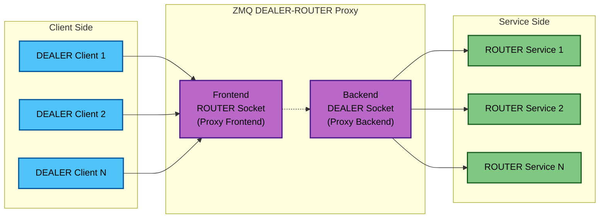
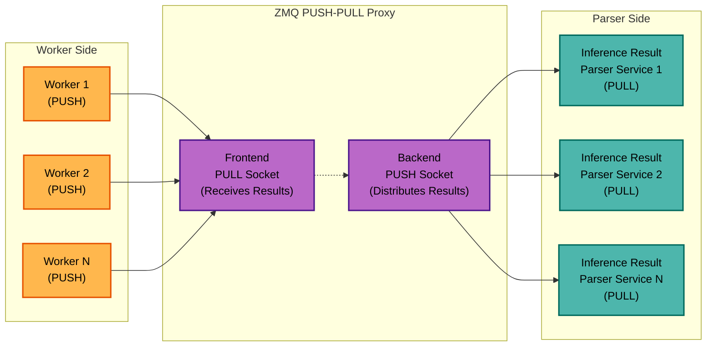
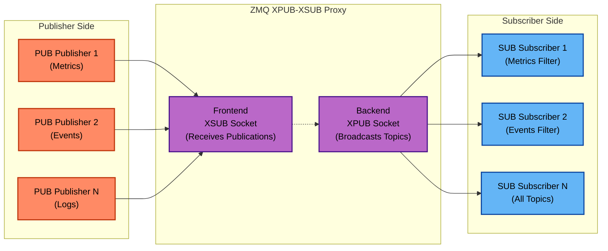

<!--
# SPDX-FileCopyrightText: Copyright (c) 2025 NVIDIA CORPORATION & AFFILIATES. All rights reserved.
# SPDX-License-Identifier: Apache-2.0
-->
# ZMQ Proxy Types

## ZMQ DEALER<->ROUTER Proxy

> [!TIP]
> Use when you need to load balance client requests across multiple services and require responses back to the original clients.

The proxy acts as an intermediary that enables many-to-many communication between `DEALER` clients and `ROUTER` services while maintaining proper message routing.

### Key Components
1. **`DEALER` Clients** (left side): Multiple clients that send requests using `DEALER` sockets
2. **Proxy Frontend** (`ROUTER` socket): Receives and queues messages from all `DEALER` clients
3. **Proxy Backend** (`DEALER` socket): Forwards messages to available `ROUTER` services (note: no identity for transparency as mentioned in the code comments)
4. **`ROUTER` Services** (right side): Multiple service instances that process requests

### Message Flow
- Requests flow left-to-right: `DEALER` clients → Frontend `ROUTER` → Backend `DEALER` → `ROUTER` services
- Responses flow right-to-left automatically through the same path
- The ZMQ proxy handles automatic load balancing and routing envelope preservation

### Benefits
- **Load Balancing**: Distributes requests across multiple services
- **Decoupling**: Clients don't need to know about individual service addresses
- **Scalability**: Services can be added/removed without client changes
- **Automatic Routing**: ZMQ handles request/response correlation automatically

## ZMQ PUSH->PULL Proxy

> [!TIP]
> Use when you need to distribute work items from multiple producers to multiple workers in a fire-and-forget manner without needing responses.

### Message Flow
- **Workers** (left) generate and send inference results using `PUSH` sockets
- **Proxy Frontend** (`PULL` socket) receives all inference results from workers
- **Proxy Backend** (`PUSH` socket) distributes results to available parser services
- **Inference Result Parser Services** (right) consume and process the results using `PULL` sockets

### Key Benefits
- **Load Balancing**: Inference results are automatically distributed across multiple parser services
- **Decoupling**: Workers don't need to know about specific parser services
- **Scalability**: You can add/remove parser services without affecting workers
- **Efficiency**: Fire-and-forget messaging ensures workers aren't blocked waiting for processing

## XPUB -> XSUB Proxy

> [!TIP]
> Use when you need to broadcast topic-based messages from multiple publishers to multiple subscribers with automatic subscription filtering.

### Key Components
1. **`PUB` Publishers** (left side): Multiple publishers that broadcast messages on different topics (Metrics, Events, Logs, etc.)
2. **Proxy Frontend** (`XSUB` socket): Receives all publications from publishers and manages subscriptions
3. **Proxy Backend** (`XPUB` socket): Broadcasts messages to subscribers based on their topic filters
4. **`SUB` Subscribers** (right side): Multiple subscribers that filter and receive only the topics they're interested in

### Message Flow
- **One-to-Many Broadcasting**: Publishers send to all interested subscribers
- **Topic-Based Filtering**: Subscribers only receive messages matching their filter criteria
- **Subscription Management**: The proxy handles subscription requests automatically

### Key Benefits
- **Topic Filtering**: Subscribers only get relevant messages
- **Decoupling**: Publishers don't need to know about subscribers
- **Scalability**: Add publishers/subscribers without affecting others
- **Efficiency**: Only subscribed-to messages are delivered to each subscriber

### Use Cases
- **Metrics Broadcasting**: Performance metrics to monitoring dashboards
- **Event Notifications**: System events to multiple logging/alerting services
- **Real-time Updates**: Live inference results to multiple visualization tools
- **System Monitoring**: Health status updates to various monitoring components

### Simplifies Many-to-Many Communication

#### Without XPUB-XSUB Proxy (Traditional Approach)
- Each publisher would need individual connections to every subscriber
- Publishers must know all subscriber addresses
- Adding/removing participants requires reconfiguring everyone
- Complex subscription management across multiple connections

#### With XPUB-XSUB Proxy (Simplified Approach)
- All publishers connect to ONE proxy frontend
- All subscribers connect to ONE proxy backend
- Publishers and subscribers are completely decoupled
- Single point of subscription management
