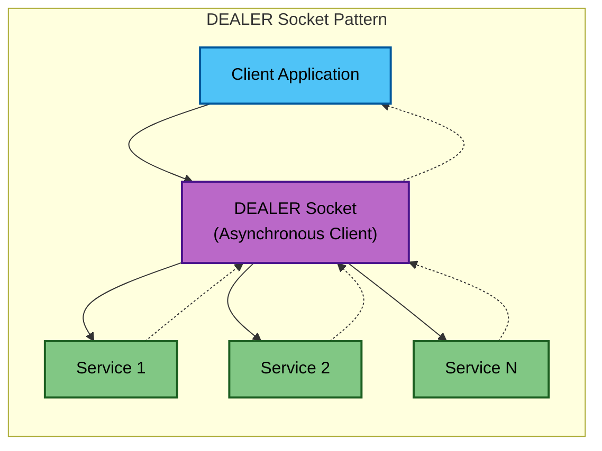
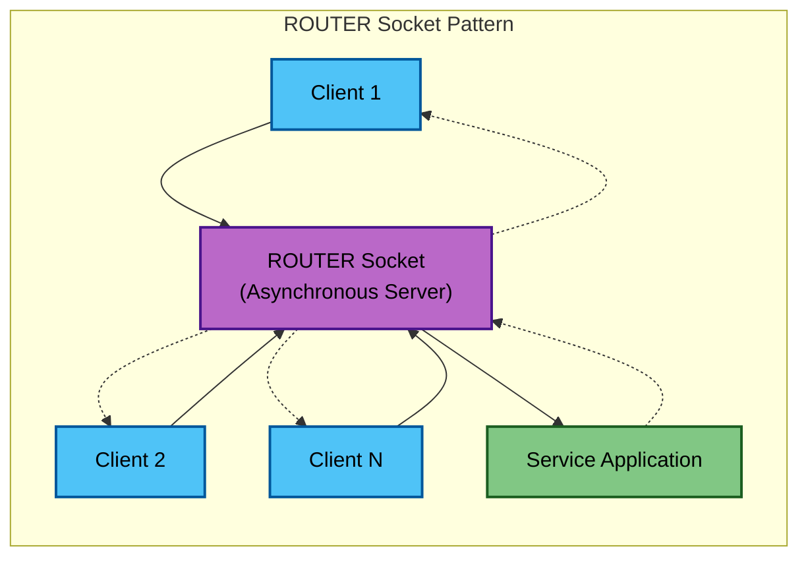
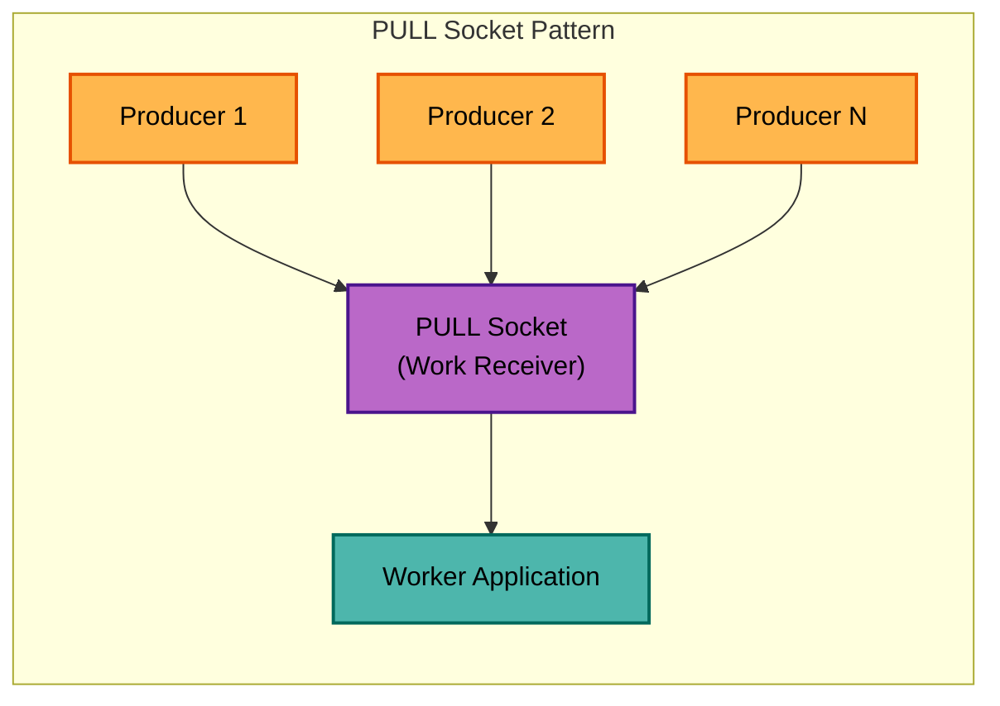
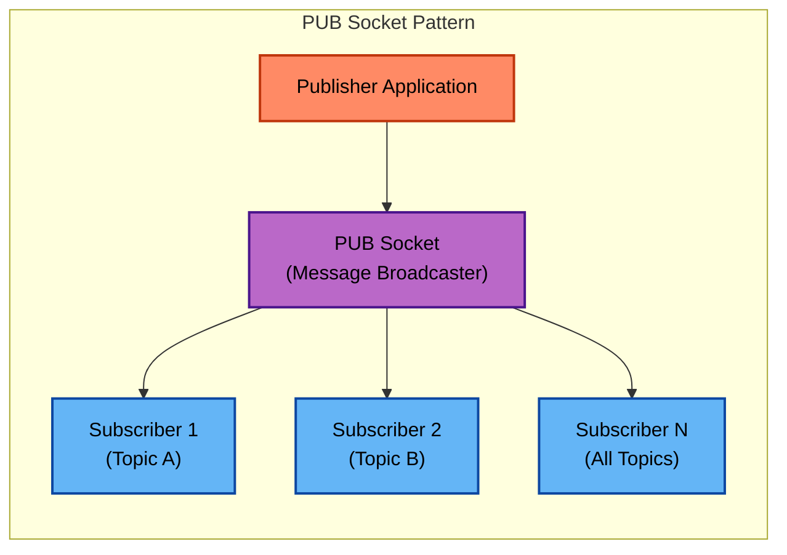
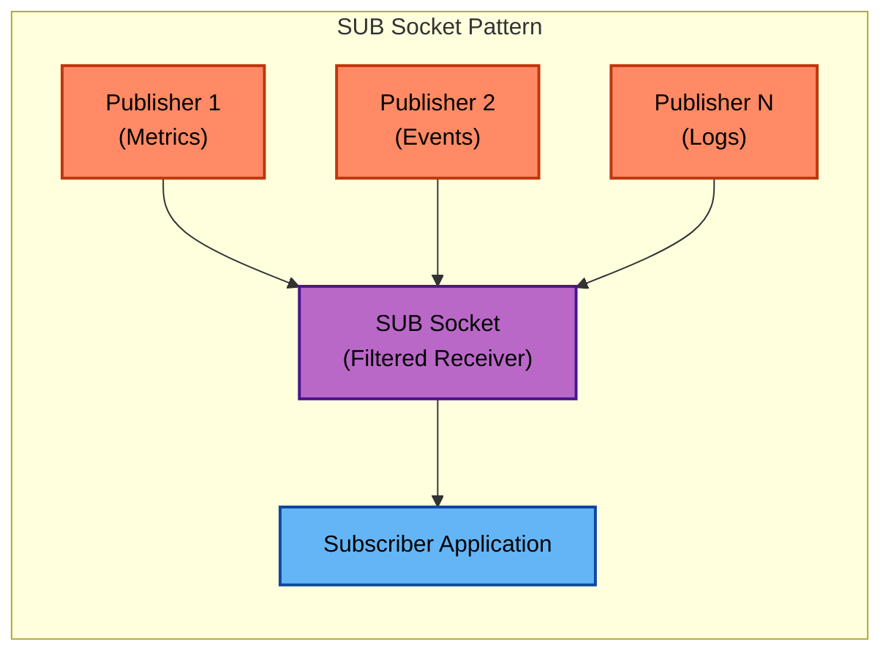
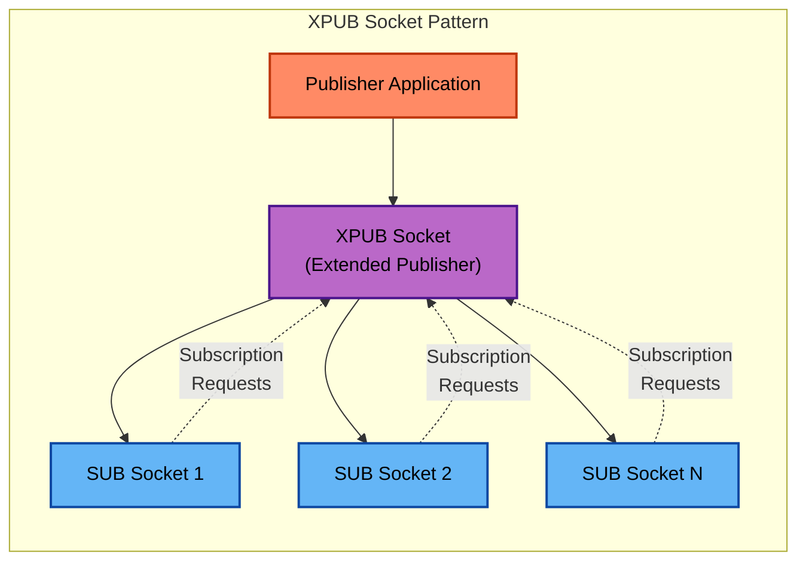
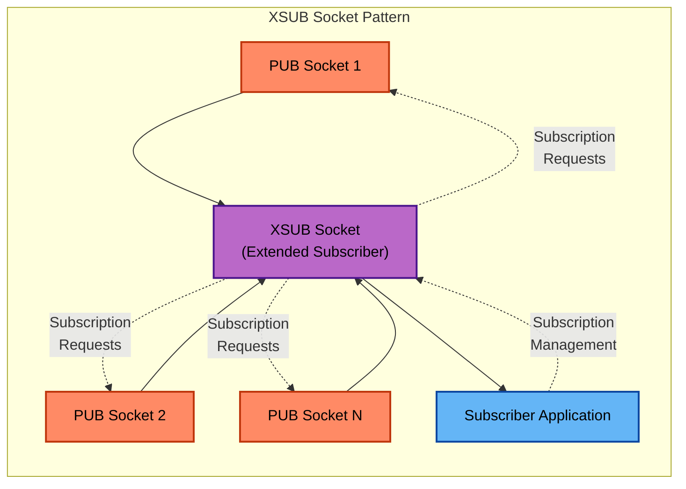

<!--
# SPDX-FileCopyrightText: Copyright (c) 2025 NVIDIA CORPORATION & AFFILIATES. All rights reserved.
# SPDX-License-Identifier: Apache-2.0
-->
# ZMQ Socket Types

> [!TIP]
> See [ZMQ Proxies Documentation](zmq-proxies.md) for information on ZMQ Proxies

## **DEALER Socket**

Asynchronous client that load balances requests across multiple services
- Sends requests to available services in round-robin fashion
- Can handle multiple concurrent requests without blocking
- Each request gets routed to the next available service

## **ROUTER Socket**

Asynchronous server that receives requests from multiple clients
- Routes incoming requests to the application for processing
- Maintains client identity for proper response routing
- Can handle multiple concurrent clients simultaneously

## **PUSH Socket**

Work distributor that sends tasks to workers (fire-and-forget)
- Distributes work items to available workers in round-robin
- No responses expected - pure fire-and-forget messaging
- Ideal for distributing computational work

## **PULL Socket**

Work receiver that accepts tasks from producers
- Receives work items from multiple producers fairly
- Processes work without sending responses back
- Perfect for worker processes in pipeline architectures

## **PUB Socket**

Message broadcaster that publishes to subscribers
- Sends messages to all connected subscribers
- Subscribers filter messages based on topics
- One-way communication (no responses)

## **SUB Socket**

Message receiver with topic filtering
- Connects to publishers and filters desired topics
- Only receives messages matching subscription filters
- Passive receiver (cannot send messages back)

## **XPUB Socket**

Extended publisher with subscription awareness
- Like `PUB` but can receive subscription requests
- Forwards subscription messages upstream
- Used primarily in proxy configurations

## **XSUB Socket**

Extended subscriber for proxy scenarios
- Like `SUB` but can forward subscription requests
- Manages subscription state for downstream subscribers
- Used primarily as proxy frontend for pub/sub patterns

